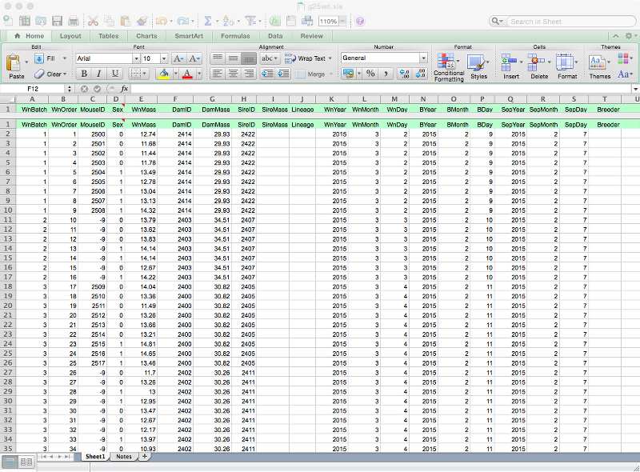
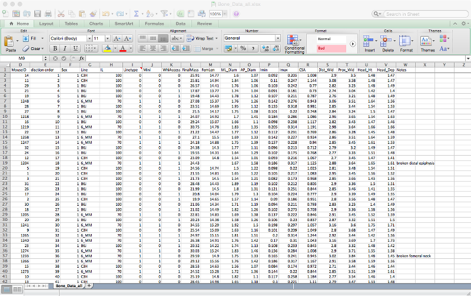
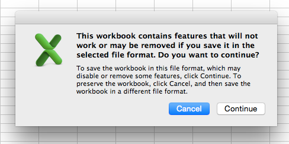
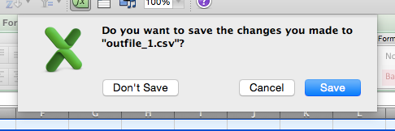

```{r setup, echo=FALSE, message=FALSE}
library(tidyverse)
library(readxl)
library(cowplot)
```

# Notes

## Readings

---

> "For example, last month I was working on a problem of logistic regression that I suspected had mislabeled outcomes (some zeroes turned to ones, and vice versa), and read up on some robust logistic regression methods, implemented in the robust package. But I wasn't sure they would be effective on my data, so I did some random simulation of mislabeled outcomes and applied the method. The method didn't work as well as I needed it to, which saved me from applying it to my data and thinking I'd solved the problem.

> For this reason, no matter how much math and proofs there are that show a method is, I really only feel comfortable with a method once I've worked with it simulated data. It's also a great way to teach myself about the statistical method." [David Robinson](http://varianceexplained.org/r/simulation-bayes-baseball/)

## Learning a programming language

Like learning a foreign language.

- Practice
- Struggle
- Gradual proficiency

## What do you mean programming?

Modern Scientist == Programmer

- 95% of your analysis time is spent _not_ doing statistics.
    - Wrangling data
- Invest time now in learning the logic of programming. Save time later.
- Reproducibility. You always know what you did.
    - Code with comments reads as a step-by-step of your analysis
- This is a process. It takes time to learn and be comfortable.

## Why program?

> "If you had done something twice, you are likely to do it again." -- Brian Kernighan and Bob Pike

## Good things about programming with data

- Forces you to be explicit.
    - R won't give unless you ask.
- Forces you to have a record of your analysis.
    - Add to/modify your data and rerun
    - No point and click hell
- Allows you to keep versions of your analysis
    - Revert to an older version

## R and RStudio

- You are living in a good time.
    - The R Renaissance (2012 - present)
    - The DaRk Ages (1993-2011)
- People have extened the basic R functionality
    - Reading & writing data
    - Working with data (selecting, filtering, aggregating)
    - Plotting

.center[]

## Base R vs. new tools

- Should you learn the base R way or the new tools?
    - Both, eventually.
    - We will use the new tools mostly. Difficult tasks become easy.

.center[]

## The tidyverse

A set of packages to load, clean, filter, plot, and generally deal with data in a "tidy" way. Largely the work of [Hadley Wickham](http://hadley.nz/).

```{r eval=FALSE}
install.packages("tidyverse") # Once
library(tidyverse)
browseVignettes("tidyverse")
```

Read [The Tidy Tools Manifesto](https://cran.r-project.org/web/packages/tidyverse/vignettes/manifesto.html)

## Rules for raw data

- Store your data in its rawest form
    - Excel ok
- Do you any calculations/analysis elsewhere
    - **No stats or plots in Excel**
    - So many reasons
- Everything should be reproducible
    - Script your analysis
    - No point and click

## Opinionated rules for data files 

- Garland [*How to Structure and Name Data Files*](http://biology.ucr.edu/people/faculty/Garland/How_to_Structure_and_Name_Data_Files_1.pdf)
- Karl Broman's guide to data organization: http://kbroman.org/dataorg/
- Leek research group's guide to sharing data: https://github.com/jtleek/datasharing
- Wickham (2013): [Tidy Data](http://vita.had.co.nz/papers/tidy-data.pdf)
- White et al. (2013): [Nine Simple Ways to Make It Easier to (Re)use Your Data](http://ojs.library.queensu.ca/index.php/IEE/article/view/4608)

## Guidelines for data files

- Think about how to store your data _before_ you have data to store
    - Get it right the first time rather than to deal with bad decisions forever
- Keep everything.
    - Disk space is cheap.
    - Dropbox / Box / Google Drive / Sync, etc.
    - Iterate file names (or -- better -- use version control)
- Be consistent
    - File names, variable names, file formats, etc.
    - No spaces in data file names

## Guidelines for data files

- Store data in the rawest form
    - No transformations, calculations, etc.
- Store data in rectangular format
    - No empty cells, repeat values if necessary
- Use only one header row
    - Curse software that outputs more than one header row
- Use `NA` for missing data
- Use wide format
    - Each unique observation unit is a row

## Guidelines for data files

- No spaces or units in column names
    - `body_mass` or `BodyMass` but not "Body Mass" or "Body Mass (g)"
- Store dates as three separate columns (`Year`, `Month`, `Day`)
    - Excel does weird things with dates
    - With concatentation, it is easy to make date columns if you need them
    - We might be in the minority here.

## Guidelines for data files

- Create a data dictionary (explanations of what your columns represent)
    - Cell comments, a separate Excel sheet, or separate file
        - *Not in the column names*
    - "Body mass in grams, measured to nearest 0.1 g."
- Keep file sizes manageable
    - Do you need 384 columns in that Excel file?
    - Use shared numeric IDs so that you can match and merge data across files

## Examples, bad and good



## Examples, bad and good



## It would be nice to store data in csv files and edit in Excel, but...



## and



- Working with csv files in Excel _not_ a viable (not-aggravating) option.
- If you are entering data, use .xls or .xlsx and trust that translators will be available for as long as you are a scientist
- If you are outputting data from another program, use csv or tab-delimits (if your data has commas).

## Some hope: Comma Chameleon

- Simple, cross-platform csv editing.
- http://comma-chameleon.io/

## Reading delimited files into R

- csv: `read.csv()`
- tab or otherwise delimited: `read.table()`
- [readr](https://cran.r-project.org/web/packages/readr/index.html)
    - `read_delim()`
    - `read_csv()`
    - Like their base R counterparts but with more logical defaults

## Beware of stringsAsFactors "feature"

- Base R file readers (`read.csv()`, `read.table()`, etc.) automatically convert strings into factors (`stringsAsFactors = TRUE`).
- This is *probably* what you want, but it can be a giant pain if you don't.
  - You likely don't want your "Notes" column as a factor

## Beware of stringsAsFactors "feature"

Options:

- Pass `stringsAsFactors = FALSE` as a parameter.
- Use `readr` functions `read_delim()` and `read_csv()`.

Also see:

- http://notstatschat.tumblr.com/post/124987394001/stringsasfactors-sigh
- http://simplystatistics.org/2015/07/24/stringsasfactors-an-unauthorized-biography/

## Reading Excel files into R

Package: [readxl](https://cran.r-project.org/web/packages/readxl/index.html)

```{r eval=FALSE}
library("readxl")

M <- read_excel("MyFile.xlsx")
```

## Other, less friendly R packages for reading Excel files

In descending order of friendliness:

1. xlsx: https://cran.r-project.org/web/packages/xlsx/index.html
1. XLConnect: https://cran.r-project.org/web/packages/XLConnect/index.html
1. gdata: https://cran.r-project.org/web/packages/gdata/index.html

## Load some data

```{r message=FALSE, warning=FALSE}
M <- read_excel("../data/Mouse_Weaning_Data.xlsx",
                na = "NA")
```

- Read file and assign to an object `M`.
    - Look for it in the `data` directory, which is one level up from the working directory
    - Explicitly say that "NA" is `NA`
- Use `<-` for assign.
    - Don't use `=` (even though you can).
    - "Assign the object on the right to the object on the left."

### Use `str()` to get information

```{r}
str(M)
```

## `data.frame()`: a basic unit of storage

Mixed data types

  - Numeric
  - Character
  - Factor (categorical)
  - Boolean (TRUE and FALSE)

`read_excel()` produces `tbl_df`s, which print a little prettier but are otherwise equivalent and completely compatible.

## Selecting and filtering

- Selecting columns
- Filtering a subset of rows
- Aggregating summary statistics

## Selecting columns: Base R

```{r eval=FALSE}
M$WnMass
```

`$` returns a single column from a `data.frame`. You'll use this form most often day to day.

## Selecting columns: Base R

```{r eval=FALSE}
M[ , "WnMass"]  # Only the column WnMass
M[ , 1:3]       # Columns 1-3, all rows
```

`[rows, columns]` returns rows and columns from a `data.frame`.

If either is empty, all are returned.

- All rows are returned here. The space before `,` is empty.

## Filtering rows: Base R

```{r eval=FALSE}
M[1, ]     # Row 1, all columns
M[1:5, ]   # Rows 1-5, all columns
```

- The space after `,` is empty, so all columns are returned.

## Filtering rows: Base R

Use `head()` to get a peek at the first few rows. A second argument to `head()` specifies the number of rows to show.

```{r}
head(M[, c("MouseID", "Sex")])
```

## Selecting and filtering simultaneously: Base R

`subset()` or `[ , ]`

```{r}
subset(M, WnMass < 6)
```

## Selecting and filtering simultaneously: Base R

`subset()` or `[ , ]`

```{r eval=FALSE}
subset(M, Sex == 1 & DamID == 1932, select = "WnMass")
```

Use `&` for "and", and `|` for "or."

## Making new columns

- Calculate new variables
    - Transformation, etc.
- Combine existing variables into a new variable
    - e.g., year, months, day columns into a date
- Splitting existing variables into >1 new variables

## Calculate new variables: Base R

Data transformations:

`M\$log10_WnMass <- log10(M\$WnMass)`
`M\$sqrt_WnMass <- sqrt(M\$WnMass)`

_Note_:

- `log()` performs natural log.
- `log10()` performs base-10 log.

## Aggregating: Base R

- Mean of every column that is not `DamID`. `head()` gives the first few rows.
- Replace `mean` with `sd` to get standard deviation.

```{r}
M_agr <- aggregate(M, by = list(M$DamID), FUN = "mean")
head(M_agr)
```

## Aggregating: Base R

Subset, then aggregate

```{r}
M_Dam_Mass <- M[, c("DamID", "WnMass")]
head(aggregate(M_Dam_Mass, by = list(M$DamID), FUN = "mean"))
```

Less messy, but still needing some fixing. `Group.1` is Dam ID.

## New tools: Selecting, filtering, aggregating

- **dplyr**: https://cran.r-project.org/web/packages/dplyr/index.html
- **tidyr**: https://cran.r-project.org/web/packages/tidyr/index.html

Tutorials:

- http://seananderson.ca/2014/09/13/dplyr-intro.html
- https://rpubs.com/bradleyboehmke/data_wrangling

```{r}
library("dplyr")
library("tidyr")
```

## tidyr

tidyr is most useful for moving data between "wide" and "long" formats:

- `gather()`: wide to long
- `spread()`: long to wide

Utility functions for existing variables:

- `separate()`: splitting variables (1 column to >1)
- `unite()`: joining variables (>1 columns to 1)

## Combine existing variables: tidyr

```{r}
M <- M %>% unite(col = "YearMo", WnYear, WnMonth,
                 sep = "_", remove = FALSE)
M %>% select(WnYear, WnMonth, YearMo) %>% head()
```

`remove = FALSE` means that the pre-existing variables are not removed.

## Main functions in dplyr

- `mutate()`: create new columns
- `glimpse()`: like `str()`
- `select()`: like `[ , ]` for columns
- `filter()`: like `subset()` or `[ , ]` with conditions
- `summarize()` with `group_by()`: like `aggregate()`
- `arrange()`: sorting
- `join()`: merging `data.frames`

Functions can (should) be chained together with `%>%`

- pass the result of the lefthand expression to the righthand expression.

## Calculate new variables: ddply

```{r eval=FALSE}
M <- M %>%
  mutate(log10DamMass = log10(DamMass))
```

- Assigning back to itself just adds the column `log10DamMass` to the end of the `data.frame`.

## `mutate()` or not?

`mutate()` lets you add many new variables at once.

```{r eval=FALSE}
M$log10_WnMass <- log10(M$WnMass)
M$log10_DamMass <- log10(M$DamMass)
```

vs.

```{r}
M <- M %>% mutate(log10WnMass = log10(WnMass),
                  log10DamMass = log10(DamMass))
```

## `glimpse()` is like `str()`

```{r}
glimpse(M)
```

## Selecting columns: dplyr

```{r}
M %>% select(Sex, WnMass, DamID)
```

## Chaining operations: dplyr

```{r}
M %>% select(starts_with("wn")) %>% glimpse()
```

For more information and examples: `?select`

`starts_with()`, `ends_with()`, `contains()`, `matches()`, `num_range()`, `one_of()`, `everything()`

## Filtering: dplyr

```{r}
M %>% filter((WnMass < 6 | WnMass > 19) & Sex == 0)
```

## Sorting: dplyr

```{r}
M %>% filter((WnMass < 6 | WnMass > 19) & Sex == 0) %>%
  arrange(WnMass)
```

## Selecting and filtering

```{r}
M %>% filter((WnMass < 6 | WnMass > 19) & Sex == 0) %>% 
  select(MouseID, DamID, WnMass)
```

## Aggregating: dplyr

Start by grouping data by some categorical variable:

```{r}
M %>% group_by(Sex)
```

--

# Aggregating: dplyr

Pass the grouped data to `summarize()`. Return the mean and standard deviation.

```{r}
M %>% group_by(Sex) %>% summarize(mean(WnMass), sd(WnMass))
```

## Aggregating: dplyr

What's going on with `NA`?

```{r}
sum(is.na(M$Sex))
```

- `is.na()` returns `TRUE` if the value is `NA`
- Summing them converts `TRUE` to 1
- We should probably drop those rows

## Filtering out unwanted rows

```{r}
M_no_NAs <- M %>% filter(!is.na(Sex))
```

`!is.na()` returns `TRUE` for the values of `Sex` _not_ `NA`.

```{r}
sum(is.na(M_no_NAs$Sex))
```

```{r}
M_no_NAs %>% group_by(Sex) %>% summarize(mean(WnMass), sd(WnMass))
```

## Analysis workflow

1. Enter data (Excel, e.g.)
1. Load raw data and perform manipulations
    * Recode variables
    * Create categorical variables where applicable
    * Combine and transform variables if necessary
1. Plot the raw data to look for mistakes, outliers, etc.
    * Go back and fix errors
    * Explore your data
1. Statistical analysis
1. Interpretation
    * More analysis
1. Make tables and figures for publication
