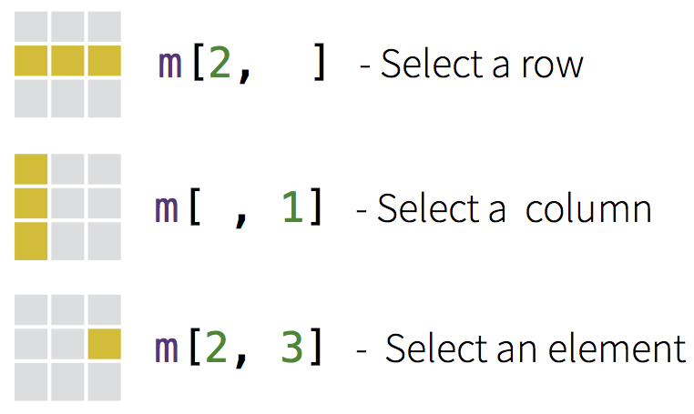

```{r setup, echo=FALSE, message=FALSE}
library(tidyverse)
library(readxl)
library(cowplot)
```

## Notes

None for this lecture.

## Readings

None for this lecture.

---

> "For example, last month I was working on a problem of logistic regression that I suspected had mislabeled outcomes (some zeroes turned to ones, and vice versa), and read up on some robust logistic regression methods, implemented in the robust package. But I wasn't sure they would be effective on my data, so I did some random simulation of mislabeled outcomes and applied the method. The method didn't work as well as I needed it to, which saved me from applying it to my data and thinking I'd solved the problem.

> For this reason, no matter how much math and proofs there are that show a method is [reliable], I really only feel comfortable with a method once I've worked with it simulated data. It's also a great way to teach myself about the statistical method." [David Robinson](http://varianceexplained.org/r/simulation-bayes-baseball/)

## Learning a programming language

Like learning a foreign language.

- Practice
- Struggle
- Gradual proficiency
- Lectures, talks, and bootcamps won't help you as much as hands-on practice.

## What do you mean programming?

Modern Scientist == Programmer

- 95% of your analysis time is spent _not_ doing statistics.
    - Wrangling data
- Invest time now in learning the logic of programming. Save time later.
- Reproducibility. You always know what you did.
    - Code with comments reads as a step-by-step of your analysis
- This is a process. It takes time to learn and be comfortable.

## Why program?

> "If you had done something twice, you are likely to do it again." -- Brian Kernighan and Bob Pike

## Good things about programming with data

- Forces you to be explicit.
    - R won't give unless you ask.
- Forces you to have a record of your analysis.
    - Add to/modify your data and rerun
    - No point and click hell
- Allows you to keep versions of your analysis
    - Revert to an older version

## R and RStudio

You are living in a good time.

  - The R Renaissance (2012-present)
  - The DaRk Ages (1993-2011)

<center></center>

## Base R vs. new tools

People have extened the basic R functionality

  - Reading, writing, and working with data (selecting, filtering, aggregating, plotting)

Should you learn the base R way or the new tools?

  - Both, eventually.

<center></center>

## The tidyverse

A set of packages to load, clean, filter, plot, and generally deal with data in a "tidy" way. Largely the work of [Hadley Wickham](http://hadley.nz/).

```{r eval=FALSE}
install.packages("tidyverse") # Once
library(tidyverse)
```

- We will start using these tools next week.
- Read [The Tidy Tools Manifesto](https://cran.r-project.org/web/packages/tidyverse/vignettes/manifesto.html)

## Kinds of data in R

- Character ("a", "Female", "The quick brown fox")
- Numeric (1.25, 1e6) or integer (1)
- Logical (`TRUE` or `FALSE`)
- Factor (categorical)

## Common R objects

1. Vectors
1. Matrices
1. data.frames
1. Functions

## Vectors

```{r}
x <- c(112, 2.2, 7, 14.1)
x
x[2]
sort(x)
```

## Vectors

```{r}
y1 <- 1:10
y2 <- seq(1, 10, length = 20)
y1[1:3]
y2[1:3]
```

## Vectors

```{r}
x + 10
y1^2
min(x)
max(x)
```

## Vectors

```{r}
sqrt(y2)
y2_mean <- mean(y2)
y2_sd <- sd(y2)
y2_mean
y2_sd
```

## Matrices

Square object of one data type

- Indexed by [Rows, Columns] (think "RC Cola")
- Default is to fill by column (`byrow = TRUE` for rowwise)

```{r}
M <- matrix(1:9, nrow = 3, ncol = 3)
M
M[2, 2]
```

## Matrices

```{r}
M[1, ]
M[, 1]
```

<center></center>

## `data.frame()`: a basic unit of storage

Mixed data types per column

  - Numeric
  - Character
  - Factor (categorical)
  - Logical (`TRUE` and `FALSE`)

`read_excel()` produces `tbl_df`s, which print a little prettier but are otherwise equivalent and completely compatible.

## Making data.frames

```{r}
M <- data.frame(x = 1:3,
                y = c(10, 17, 21),
                A = c("a", "b", "c"))
M
```


## Extracting from data.frames

Either `$` or `[, ]` notation (with quoted column names).

```{r}
M$x
M$A
M[, "y"]
```

## Extracting from data.frames

```{r}
M[2, ]
M[, 2]
```

## Functions

We will get to writing our own functions later, for now: `functionName()`, where parameters go inside ().

```{r}
c(1)
sqrt(256)
```

## Functions

```{r}
log(2.718)
exp(1)
```

Get help from the R command line with ?: `?sqrt` or `?log10`. Also try `help.search("mean")`, etc.

## Analysis workflow {.smaller}

1. Enter data (e.g., Excel)
1. Load raw data and perform manipulations
    * Recode variables
    * Create categorical variables where applicable
    * Combine and transform variables if necessary
1. Plot the raw data to look for mistakes, outliers, etc.
    * Go back and fix errors
    * Explore your data
1. Statistical analysis
1. Interpretation
    * More analysis
1. Make tables and figures for publication
