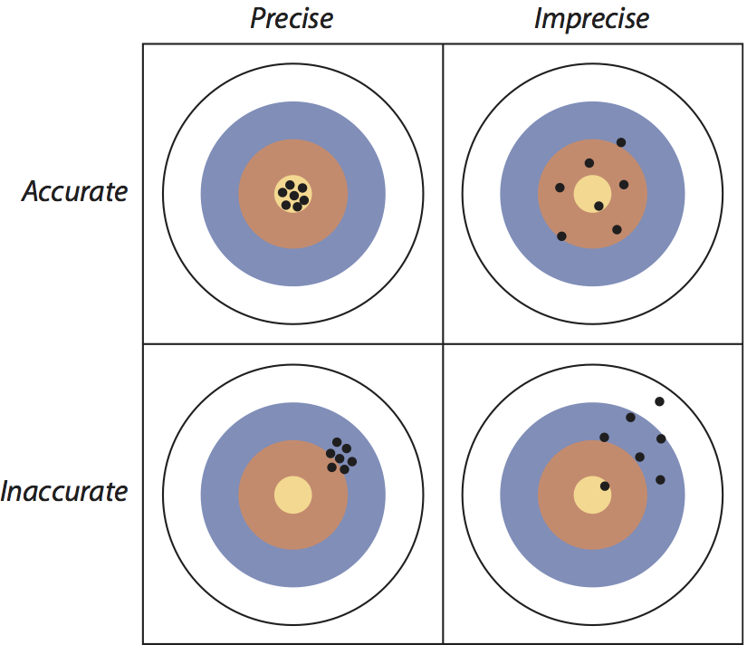

```{r setup, echo=FALSE, message=FALSE}
library(tidyverse)
library(readxl)
library(cowplot)
```

## Notes

## Readings

- Curran-Everett [-@curran-everett_process_2000]: The process of scientific discovery: How certain can we be?
- Curran-Everett [-@curran-everett_explorations_2009]: Explorations in statistics: confidence intervals

## Definitions of statistics

"a collection of procedures and principles for gaining **information** in order to make decisions when faced with **uncertainty**" [@utts_seeing_2005]

"a way of taming **uncertainty**, of turning raw **data** into arguments that can resolve profound questions" [@amabile_all_1989]

"the science of drawing conclusions from **data** with the aid of the mathematics of **probability**" [@garfunkel_statistics_1986]

"the **explanation** of **variation** in the context of what remains **unexplained**" [@kaplan_statistical_2009]

## Key concepts in statistics

**Data**: The raw material for doing statistics are data, which come in a variety of forms.

**Information**: The goal of statistics is to gain information, make a decision, or explain.

**Uncertainty**: The context for statistics is that there is always some level of uncertainty

**Probability**: The tool that we will use to assess our uncertainty and gain information is probability.

## Statistics in the context of life sciences

- Describe, measure, and compare aspects of nature from **samples**
- Quantify the **uncertainty** of those measures
- **Estimation** of an unknown quantity from a **sample** of a **population**
    - *Differences* between groups
    - *Relationships* between variables or traits

## Samples and populations

A **population** includes all the members/individuals/units of a group of interest.

- A parameter is a quantity that describes a population without error (e.g., means, standard deviations, proportions). Requires measuring *every* member of that group.

## Samples and populations

A **sample** is a representative subset of a population, ideally randomly chosen. A sample can be an individual subject or a group of subjects.

- An estimate is the inferred value of a parameter based on a sample from a population.

*You will (usually) deal with samples.*

## Deviations resulting from sampling

**Sampling error** is the deviation from the population parameter resulting from chance alone.

- **Precision** is the departure of the estimate from the true population parameter resulting from sampling error.

**Bias** is the *systematic departure* of an estimate from the population parameter being estimated.

## Goals of data collection: Low sampling error and low bias

<center>

</center>

## Thinking about sampling error and bias

Consider the scale in a physician's office. The same patient is weighed 3 times in succession:

1. 72.0 kg
2. 73.8 kg
3. 70.1 kg

True mass is 72.1 kg. Sampling error or bias?

## Thinking about sampling error and bias

Consider the same physician's thermometer. The same patient's temperature 3 times in succession:

1. 98.2°
2. 98.3°
3. 98.2°

True temperature is 99.3°. Sampling error or bias?

*What is the real challenge here?*

## Quiz 03-1

FIXME

## References
