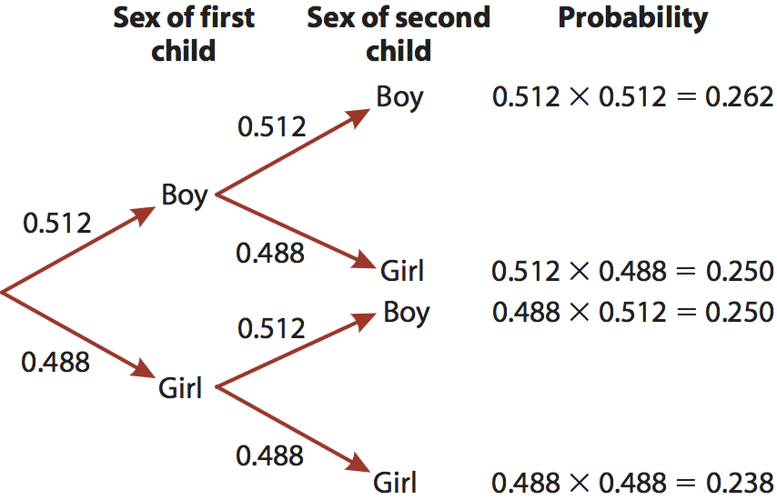
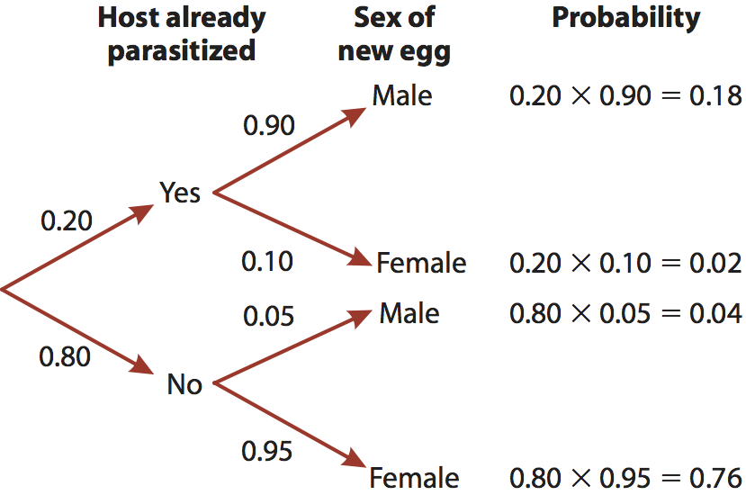
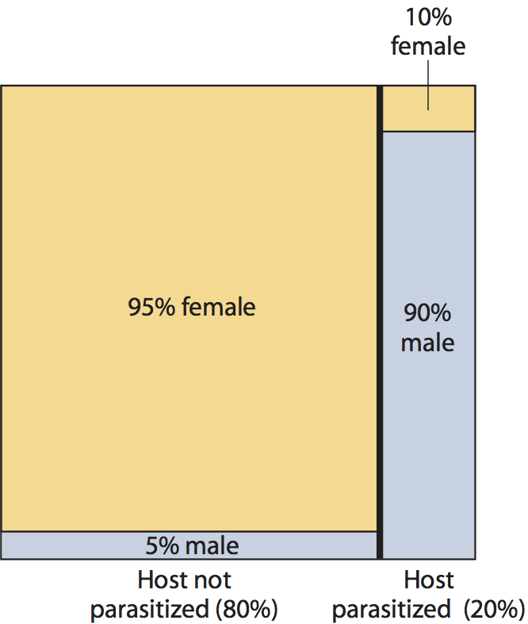
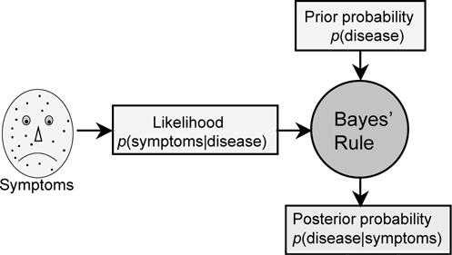
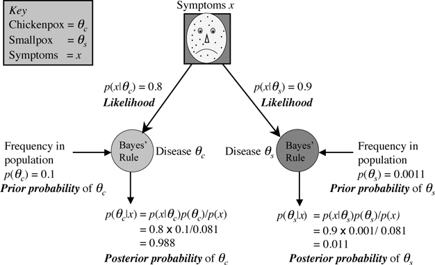

```{r setup, echo=FALSE, message=FALSE}
library(tidyverse)
library(readxl)
library(cowplot)
```

## Notes

Links to Khan Academy probability videos? FIXME

## Readings

## Why learn probability?

Basis of logical deduction

- Should you fly or drive?
- Should you not eat raw cookie dough?

Basis of inference systems

- Likelihood and Bayesian

Basis of P-values

- Cornerstone of null hypothesis testing

## Basics of probability

The probability of an event is the proportion of times the event would occur if a random trial is repeated infinitely under constant conditions.

## Basics of probability

The probability of an event is the **proportion** of times the event **would** occur **if** a **random** trial is repeated **infinitely** under **constant conditions**.

- proportion
- would occur
- if
- random trial
- infinitely
- constant conditions

## Basics of probability

Probabilities are proportions.

Pr[event] is the abbreviation for “the probability of
event A occurring.”
    - $Pr[heads] = 0.50$: Heads
    - $Pr[heads'] = 0.50$: *Not* heads

The range of probabilities for an event is 0 $\rightarrow$ 1
(including 0 and 1).

## Addition rule | Mutually exclusive events

*Mutually exclusive* events are events that are not simultaneously possible due to constraints of physics, biology, development, evolution, etc.

- $Pr[A~and~B] = Pr[A, B] = 0$
- Probability of A and B occurring simultaneously.
- e.g., You can't flip a coin heads and tails in one trial
    - $Pr[H, T] = 0$
- $Pr[A~or~B] = Pr[A] + Pr[B]$

## Multiplication rule | Independent events

If events are *independent*, then their individual probabilities do not influence each other. 

- The occurrence of one does not alter the probability of the other.
- Successive coin flips
- Successive dice rolls
- Successive roulette wheel spins
- Weekly lottery drawings
- Child sex (in the absence of bad genes)

## Multiplication rule | Independent events

$$Pr[A, B] = Pr[A] \times Pr[B]$$

<center>

</center>

## Binomial probabilities

KM's sister has 4 children of which 4 are girls. 

What is the probability of 4 girls from 4 children if $Pr[girl]=0.488$?

<center>

</center>

## Binomial probabilities

```{r}
0.488 ^ 4
dbinom(4, 4, 0.488)
```


## Conditional probability

The **conditional probability** of a dependent event is the probability of that event occurring given that another condition or conditions is met.

<center>


*Leptopilina boulardi*
</center>

## Conditional probability

<center>

</center>

## Conditional probability

<center>

</center>

## Bayes' Rule

> "All decisions should be based on evidence, but the best decisions should also be based on previous experience." Stone (2012)

$$Pr[A|B] = \frac{Pr[B|A] \times Pr[A]}{Pr[B]}$$

The conditional probability of $A$ given $B$ relies not only on the probability of $A$, but also of $B$ and of $B$ given $A$.

- Predicting events given prior knowledge of the probability of those events.
- The human brain (usually) works this way in predicting events.

## Bayes' Rule

Suppose that you wake up one day with spots all over your face. The doctor tells you that 90% of people who have smallpox have the same symptoms as you.

<center>

</center>

## Bayes' Rule

<center>

</center>

Gentle introduction: http://bit.ly/1nfNZ9p

## Bayes' Rule

<center>

</center>

$$Pr[M|P] = \frac{Pr[P|M] \times Pr[M]}{Pr[P]}$$

## Bayes' Rule

$$Pr[M|P] = \frac{Pr[P|M] \times Pr[M]}{Pr[P]}$$

$$0.9 = \frac{Pr[P|M] \times (0.18 + 0.04)}{0.2}$$

$$\frac{0.18}{0.22} = Pr[P|M] = 0.82$$

## Bayes' Rule

Choose a random person off the street and test them for HIV. The test is positive. What is the probability that they actually are HIV+?

1. 95-100%
2. 90-94%
3. 80-89%
4. 65-79%
5. <65%

## Bayes' Rule

If you *have* HIV, the probability that the test is positive is 99.9% (sensitivity)

  - $Pr[T|H] = 0.999$

If you *don't have* HIV, the probability that the test is negative is 99.99% (specificity)

  - $Pr[T'|H'] = 0.9999$

Only about 13/100000 people have HIV.

  - $P[H] = 13/100000 = 1.3 \times 10^{-4}$

## Bayes' Rule

$$Pr[H|T] = \frac{Pr[T|H] \times Pr[H]}{Pr[T]}$$

- Find $P[H|T]$

$Pr[T]$ is the challenge.

- Independent probabilities of positive test given HIV and positive test given *not* HIV

$$\left(Pr[T|H] \times P[H]\right) + \left(Pr[T'|H'] \times 1 - P[H]\right)$$

## Bayes' Rule {.smaller}

\[
\begin{aligned}
Pr[H|T] &= \frac{Pr[T|H] \times Pr[H]}{Pr[T]} \\
&= \frac{Pr[T|H] \times Pr[H]}{\left(Pr[T|H] \times P[H]\right) + \left(Pr[T'|H'] \times 1 - P[H]\right)} \\
&= \frac{0.999 \times 0.00013}{\left(0.999 \times 0.00013\right) + \left((1 - 0.9999) \times (1 - 0.00013)\right)}
\end{aligned}
\]

```{r eval=FALSE}
((0.999) * 1.3e-4) /
  ((0.999 * 1.3e-4) + ((1 - 0.9999) * (1 - 1.3e-4)))
```

## Bayes' Rule

```{r eval=TRUE}
((0.999) * 1.3e-4) /
  ((0.999 * 1.3e-4) + ((1 - 0.9999) * (1 - 1.3e-4)))
```

## Bayes' Rule

Take 100000 people:

- 13 have HIV
- 100000 – 13 = 99987 do not

Of the 13 with HIV:

- 13 * 0.999 = 12.987 test positive
- 13 * 0.001 = 0.013 do not

Of the 99987 who do not:

- 99987 * .0001 = 9.9987 test positive
- 99987 * .9999 = 99977.0013 do not

## Bayes' Rule

So if:

$Pr(H|T) = \frac{Pr(T|H) \times Pr(H)}{Pr(T)}$

Then:

$Pr(H|T) = \frac{0.999 \times (13/100000)}{(12.987 + 9.9987) / 100000} = 0.565$

Or just $12.987 / (12.987 + 9.9987)$ because the 100000s cancel out, which is the number of true positives over the total positives.

## Uncertainty

> "In scientific research, measurements are replete with randomness. Extraneous influences contaminate the measurements despite tremendous efforts to limit their intrusion." [@kruschke_doing_2015]

## Quiz 03-4

FIXME

## References
