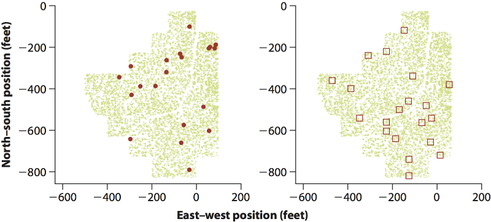

```{r setup, echo=FALSE, message=FALSE}
library(tidyverse)
library(readxl)
library(cowplot)
```

## Notes

## Readings

## Randomness

A repeatable process is random if its outcome is

- unpredictable in the short run
- predictable in the long run

e.g., coin flipping (fair coin)

- We don't know what the result of a single flip will be
- We do know what the long run probability of heads will be

## Random sampling

Assumptions of most statistical analyses

1. **Equal chance**: Each member of a population has an equal chance of being included in the sample
2. **Independence**: No member that is chosen influences the others that are chosen *or* their outcomes (e.g., trait values)

Goals:

- Minimize bias
- Allow an estimation of sampling error (an important concept)

## IID

IID: Independent and identically distributed

- All observations are independent of one another
- All observations come from the same underlying probability distribution (normal, etc.)

Standard assumption of most statistical tests.

## Probability distributions

1. Normal (Gaussian): (continuously varying) numerical values
1. Binomial: success or failure
1. Poisson: numbers of successes per unit time or space 
1. Other less often encountered probability distributions
    - **FIXME**

## Normal (Gaussian)

```{r echo=FALSE}
M <- data_frame(
  x = seq(-4, 4, length = 200),
  y = dnorm(x)) 
ggplot(M, aes(x, y)) + geom_line() +
  labs(y = "Density")
```

## Binomial

```{r echo=FALSE}
M <- data_frame(Successes = 0:10,
                Probability = dbinom(0:10, 10, prob = 0.5))
ggplot(M, aes(Successes, Probability)) + 
  geom_bar(stat = "identity") +
  scale_x_continuous(breaks = seq(0, 10, by = 1))
```

$Pr[success] = 0.5$; Trial size = $10$.

## Poisson

```{r echo=FALSE}
trials <- 20
M <- data_frame(Successes = 0:trials,
                Probability = dpois(0:trials, lambda = 5))
ggplot(M, aes(Successes, Probability)) + 
  geom_bar(stat = "identity") +
  scale_x_continuous(breaks = seq(0, trials, by = 2))
```

$\lambda = 5$

## Random sampling

Randomly select 20 trees (left) or randomly select 20 square quadrats with 0 or more trees (right).

 

How realistic is this?

## Quiz 03-3

FIXME

## References
