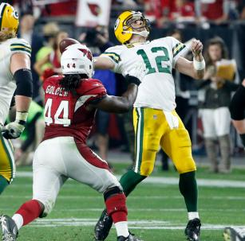

```{r setup, echo=FALSE, message=FALSE}
library(tidyverse)
library(readxl)
library(cowplot)
```

## Samples vs. populations

## Independent and identically distributed (IID)

- All observations are independent of one another
- All observations come from the same underlying probability distribution (normal, binomial, etc.)

Standard assumption of most statistical tests.

## Should the Packers have tried a 2 point conversion?

<center>

</center>

## Should the Packers have tried a 2 point conversion?

Two-point conversion + win:

- League-wide success rate (since 2003): 431 of 913

Extra point + overtime:

- Extra point success rate (2015 only): 1,131 of 1,199
- Expected winning percentage in overtime (since 2001): Away team has won 110 of 242 games

## Should the Packers have tried a 2 point conversion?

```{r}
# 2-pt conversion
431/913
```

```{r}
# Extra point + overtime
(1131 / 1199) * (110 / 242)
```

```{r}
# Odds
(431/913) / ((1131 / 1199) * (110 / 242))
```

## Should the Packers have tried a 2 point conversion?

<center>

</center>

## More binomial probabilities

About 10% of people are left handed.

- What is the probability of 0 left handed people in a *sample* of 25?
- What is the probability of exactly 1?
- What is the probability of 1 *or more*?

## More binomial probabilities

Probability density functions in R: `dbinom()`, `dnorm()`, etc.

`dbinom(x, size, prob)`

- `x` = Number of "successes"
- `size` = Sample size
- `prob` = Probability of success for each trial

## More binomial probabilities

What is the probability of 0 left handed people in a *sample* of 25?

```{r eval=FALSE}
dbinom(0, 25, prob = 0.1)
```

## More binomial probabilities

What is the probability of 0 left handed people in a *sample* of 25?

```{r}
dbinom(0, 25, prob = 0.1)
```

## More binomial probabilities

What is the probability of exactly 1?

## More binomial probabilities

What is the probability of exactly 1?

```{r}
dbinom(1, 25, prob = 0.1)
```

## More binomial probabilities

What is the probability of 1 *or more*?

## More binomial probabilities

What is the probability of 1 *or more*?

```{r}
sum(dbinom(1:25, 25, prob = 0.1))
```

## Binomial probabilities for Pr[left] = 0.1

```{r echo=FALSE}
M <- data_frame(Lefties = 0:25,
                Probability = dbinom(0:25, 25, prob = 0.1))
ggplot(M, aes(Lefties, Probability)) + 
  geom_bar(stat = "identity") +
  labs(x = "n Left-handers") +
  scale_x_continuous(breaks = seq(0, 25, by = 5))
```

$n > 8$ have very low probabilities.

## Binomial probabilities for Pr[left] = 0.1

```{r echo=FALSE}
M <- data_frame(Lefties = 0:25,
                Probability = dbinom(0:25, 25, prob = 0.1)) %>% 
  mutate(log_Prob = log10(Probability))
ggplot(M, aes(Lefties, log_Prob)) + 
  geom_bar(stat = "identity") +
  labs(x = "n Left-handers", y = "log10 Probability") +
  scale_x_continuous(breaks = seq(0, 25, by = 5))
```

## Powerball

Two pools:

1. 69 balls in one pool: Choose 5
1. 26 in the other pool: Choose 1

Number of winning combinations in pool 1 is the **binomial coefficient**

- the number of unique ordered sequences of successes that yield exactly $k$ successes from $n$ trials ("n choose k").
- the "successes" can happen in any order
- `choose(n, k)`

$$\left({n\atop k}\right)=\frac{n!}{k!\left(n - k\right)!}$$

## Powerball

```{r}
choose(69, 5)
choose(26, 1)
choose(69, 5) * choose(26, 1)
```

5 successes from 69 chances $\times$ 1 success from 26 chances.

- What if the order had to be correct as well?

## Conditional probability thought experiment

A coin is tossed 100 times. Gamblers can bet on the total number of heads that will be thrown. They can do so at any time before or during the game.

- Imagine that you're betting before the game starts. What is your best bet?

## Conditional probability thought experiment

Now imagine that you're betting after the coin was already tossed 10 times and came up heads all 10 times.

- What is the best bet now?

