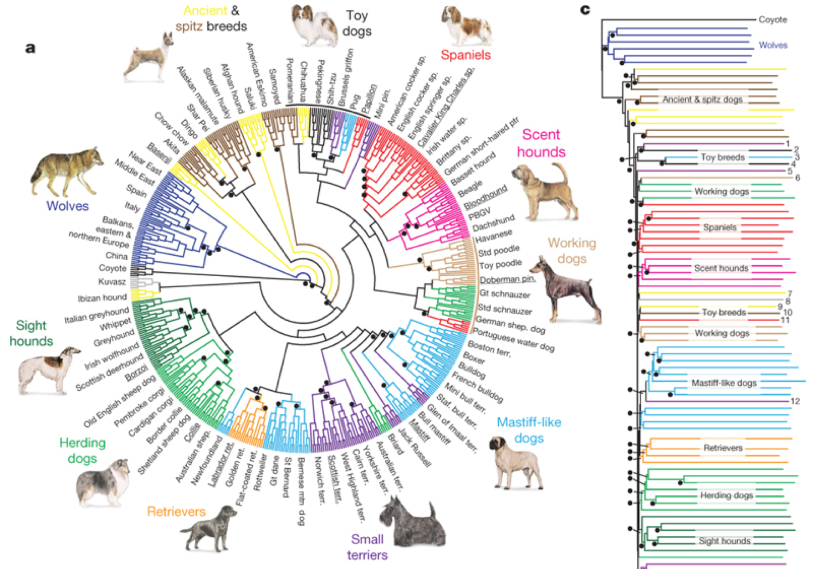
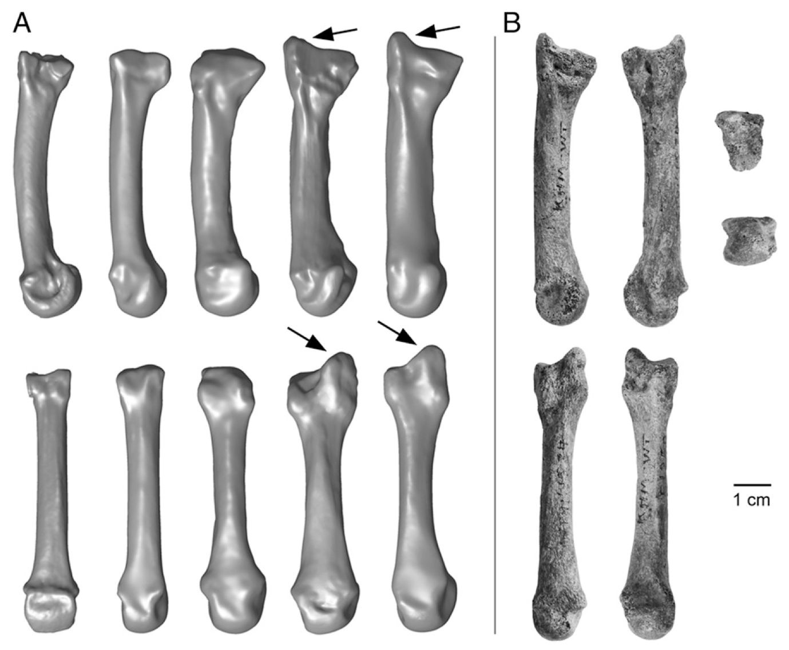
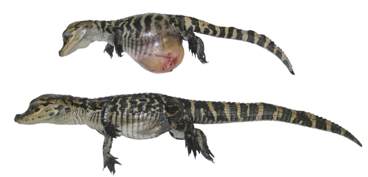
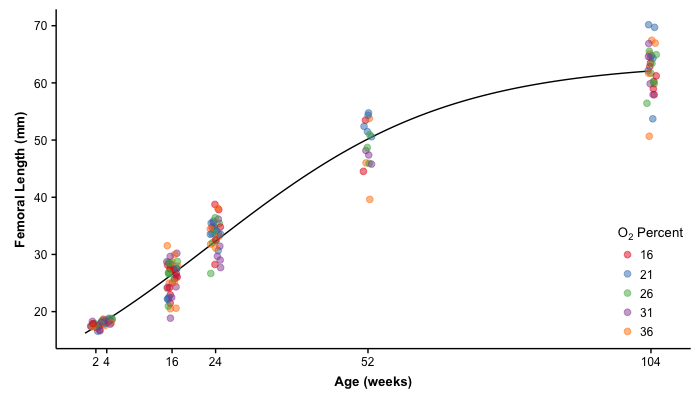
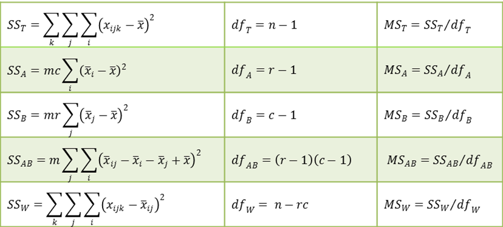

```{r setup, echo=FALSE, message=FALSE, warning=FALSE}
library(tidyverse)
library(cowplot)
```

## Remember the Goal of Statistics

> "a way of taming **uncertainty**, of turning raw **data** into arguments that can resolve profound questions" [@amabile_all_1989]

Success depends on evaluating the relative support for different *models*

## Example: Wing Dimorphic Crickets

> Do long-winged crickets have a higher resting metabolic rate than short-winged crickets?

<div class="columns-2">

<center>

<br />
<br />
<br />
</center>

Controlling for body mass,

- Metabolic rates do not differ
- Average metabolic rate of long-wings is higher
- Average  metabolic rate of long-wings is lower

</div>

## Example: Genetics of Corn Oil Content

> Which set of loci best predicts oil content in corn kernels?

<div class="columns-2">

<center>
<br />

<br />
<br />
<br />
</center>

- Heritability of corn oil content is 0
- Different possible combinations of SNPs
- All additive
- Dominance
- Epistasis
- Structural variants

</div>

## Example: Canid relationships

> What are the phylogenetic relationships between dog breeds & other canids?

<div class="columns-2">

<center>

<br />
<br />

</center>

- Star phylogeny
- Single origin of dogs
- Ancient breeds are monophyletic
- Every possible tree....
  
</div>

## Example: Predict the species of a new fossil

> Is this bone more like a chimpanzee, australopith, Neandertal, or modern human?

<div class="columns-2">

<center>
<br />

<br />
<br />
<br />
</center>

- Relative probabilities of new fossil being in one of four groups
- What is the percent correct classification of known fossils?

</div>

## Example: Alligator growth

> Do alligators exhibit determinate or indeterminate growth and does growth depend of atmospheric oxygen levels?

<div class="columns-2">

<center>

<br />
<br />
<br />
</center>

Determinate:

- von Bertalanffy
- Logistic

Indeterminate:

- Polynomial

</div>

## Example: Alligator growth

von Bertalanffy:

$$Femoral~Length\left(Age\right) = \theta_1 \left(1 - e^{-\theta_2 \left(Age - \theta_3\right)}\right)$$

Logistic:

$$Femoral~Length\left(Age\right) = \frac{\theta_1}{1 + e^{\frac{\theta_2 - Age}{\theta_3}}}$$

Polynomial:

$$Femoral~Length\left(Age\right) = a + b \cdot Age + c \cdot Age^2$$

## Example: Alligator growth

<center>

</center>

## Example: Your Research

> Your Question Here

<div class="columns-2">

<center>

<br />
<br />
<br />
</center>


- Model 1
- Model 2
- Model 3
- ...

</div>

## Frameworks for Inference using Models

1. Analytical
2. Maximum likelihood
3. Resampling
4. Bayesian

## Analytical

Algebraic (closed form) solutions for estimating parameters

$$\bar{Y} = \frac{\sum_{i=1}^{n}Y_i}{n}$$

- Historically, calculations had to be made by hand
- We made and continue to make a lot of strong inference from these calculations
    - The first ~75-100 years of experimental life sciences

## Analytical

Like the slope in bivariate regression, many are based of sums of squares (summed squared deviations).

$$b = \frac{\sum\left(X_{i}-\bar{X}\right)\left(Y_{i}-\bar{Y}\right)}{\sum\left(X_{i}-\bar{X}\right)^{2}}$$

## Formulas can get unwieldy

<center>

</center>

## Maximum likelihood

For a given mean, how likely is observing my data?

- Maximum likelihood searches for the value of the mean (or other parameter of interest) that maximizes this likelihood.

Analytical solutions are generally equal to the maximum likelihood solutions (for set of assumptions).

<center>

</center>

## Resampling & randomization

- Few constraints on data and assumptions on tests
- Repeatedly sample from or shuffle the data many times, calculating a test statistic of interest each time
- "Monte Carlo" methods

<center>

</center>

## Bayesian

What is the probability of these parameter estimates given the data and my prior knowledge?

- Inferences from data conditioned on prior knowledge
- Prior knowledge may be strong or weak

$$Pr[\theta | Data] = \frac{Pr[Data | \theta] \times Pr[\theta]}{Pr[Data]}$$

## Lecture 04-2

No quiz for this lecture.

Move on to Lecture 04-2.

## References
