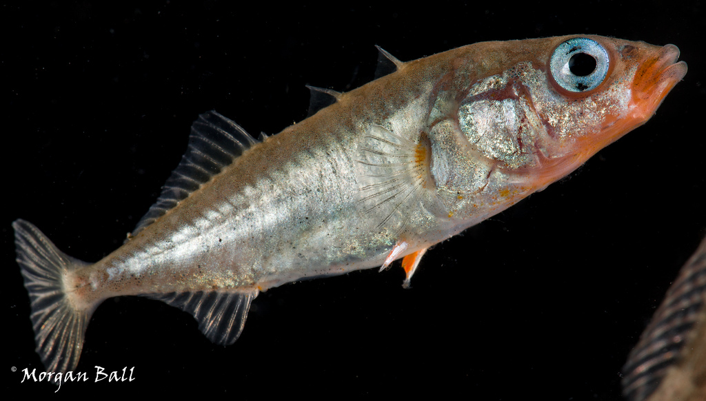
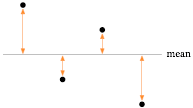
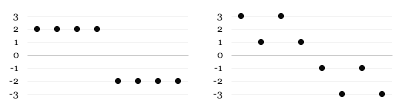
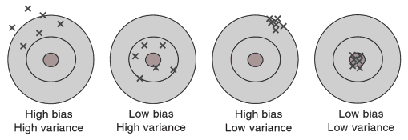

```{r setup, echo=FALSE, message=FALSE, warning=FALSE}
library(tidyverse)
library(rstan)
library(cowplot)
library(plot3D)
#library(rgl)
#setupKnitr <- function() {
#  if (requireNamespace("knitr")) {
#    knitr::knit_hooks$set(webgl = hook_webgl)
#    knitr::knit_hooks$set(rgl = hook_rgl)
#    environment(hook_webgl)$commonParts <- TRUE
#    environment(hook_webgl)$reuse <- TRUE
#  }
#}
```

## Notes

## Readings

- Curran-Everett [-@curran-everett_explorations_2009]: Explorations in statistics: confidence intervals. *AJP: Advances in Physiology Education* 2: 87-90.

## Models

> "... statisticians do not in general exactly agree on how to analyze anything but the simplest of problems. The fact that statistical inference uses mathematics does not imply that there is only one reasonable or useful way to conduct an analysis. Engineering uses math as well, but there are many ways to build a bridge." [@mcelreath_statistical_2015]

## Measures of central tendency (location)

The value around which the distribution is centered

1. Mean
1. Median
1. Mode (most common value)

## Mean

Sample (arithmetic) mean:

$$\bar{Y} = \frac{\sum^n_{i=1}Y_i}{n}$$

Please use "mean" and not "average". The arithmetic mean is one kind of average, but there are others (as there are other types of means).

- One argument: "Average" is a statistic determined by an arithmetic procedure. "Mean" is a parameter.

## Sample Mean vs. Population Mean

- The sample mean ($\bar{Y}$) is an estimation of the population mean ($\mu$).
    - What is the population of interest?
- If the sample is a *sufficiently large* random sample from the population (equal opportunity, independent), the the sample mean is an unbiased estimator of the population mean.
    - Sufficiently large suggests that small sample sizes are problematic. They are.

## Median

The median is the central measurement of a sample (the 50th percentile and the 0.50 quantile). If $n$ is even, then the median is the mean of the two middle observations.

```{r}
undulation_rate
median(undulation_rate)
```

## Mean vs. Median

Number of lateral plates (plates) in threespine sticklebacks (*Gasterosteus aculeatus*) with three different *Ectodysplasin* genotypes (mm, Mm, and MM).

<center>

</center>

## Mean vs. Median

```{r echo=FALSE}
SticklebackPlates <- read_csv("../data/Stickleback_Plates.csv")
```

```{r}
glimpse(SticklebackPlates)
```

## Mean vs. Median

```{r eval=FALSE}
ggplot(SticklebackPlates, aes(x = plates)) +
  geom_histogram() +
  facet_grid(genotype ~ .) +
  xlab("Number of Lateral Body Plates") +
  ylab("Count")
```

## Mean vs. Median

```{r echo=FALSE, message=FALSE}
ggplot(SticklebackPlates, aes(x = plates)) +
  geom_histogram() +
  facet_grid(genotype ~ .) +
  xlab("Number of Lateral Body Plates") +
  ylab("Count")
```

## Mean vs. Median

```{r echo=FALSE, message=FALSE}
ggplot(SticklebackPlates, aes(x = plates)) +
  geom_density() +
  facet_grid(genotype ~ .) +
  xlab("Number of Lateral Body Plates") +
  ylab("Probability")
```

## Mean vs. Median

```{r}
SticklebackPlates %>% group_by(genotype) %>% 
  summarize(mean(plates), median(plates))
```

## Mean is sensitive to extreme values

<center>


</center>

## When might you substitute the median for the mean?

(As a measure of central tendency)

## Why don't we always use the median?

## Measures of spread

- A measure of how much variation is present in a distribution around its center
- How widely scattered the observations are

## Percentiles and quantiles

The $X$th **percentile** of a sample is the value below which $X\%$ of the observations lie. Percentiles are reported as percent.

 **Quantile** = Percentile / 100%. The range of quantiles is $0 \rightarrow 1$.

## Quartiles and interquartile range

Quartiles

- Divide a set of data into quarters
- Minimum, maximum, 25th and 75th percentiles

Interquartile range

- Difference between the first and third quartiles

## Quartiles and Interquartile Range

The `favstats()` function from the mosaic package:

```{r eval=FALSE}
mosaic::favstats(plates, data = SticklebackPlates, groups = genotype)
```

IQR is used in boxplots, which are another way to look at distributions.

## Boxplots

Different variations, but the most standard recipe is:

1. Median = center line
2. Box = IQR (25th to 75th percentiles)
3. Whiskers at 1.5 X 25th and 75th percentiles
4. Dots for anything outside 1.5 X 25th and 75th percentiles

## Boxplots

```{r eval=FALSE}
mosaic::IQR(plates, data = SticklebackPlates, groups = genotype)
```

```{r eval=FALSE}
ggplot(SticklebackPlates, aes(x = genotype, y = plates)) +
  geom_boxplot()
```

## Boxplots

```{r echo=FALSE}
ggplot(SticklebackPlates, aes(x = genotype, y = plates)) +
  geom_boxplot()
```

## Raw data as an alternative to boxplots

When the number of observations is small, just show the raw data as points.

```{r eval=FALSE}
ggplot(SticklebackPlates, aes(x = genotype, y = plates)) +
  geom_point()
```

`x = genotype` maps the x position to the categorical variable genotype. `geom_point()` adds the points.

## Raw data as an alternative to boxplots

```{r echo=FALSE}
ggplot(SticklebackPlates, aes(x = genotype, y = plates)) +
  geom_point()
```

## Raw data as an alternative to boxplots

Add a little jitter on the x axis to keep from overplotting.

```{r eval=FALSE}
ggplot(SticklebackPlates, aes(x = genotype, y = plates)) +
  geom_point(position = position_jitter(width = 0.2))
```

## Raw data as an alternative to boxplots

Add a little jitter on the x axis to keep from overplotting.

```{r echo=FALSE}
ggplot(SticklebackPlates, aes(x = genotype, y = plates)) +
  geom_point(position = position_jitter(width = 0.2))
```

## Boxplot and raw data

```{r eval=FALSE}
ggplot(SticklebackPlates, aes(x = genotype, y = plates)) +
  geom_boxplot() +
  geom_point(position = position_jitter(width = 0.2), alpha = 0.5)
```

## Boxplot and raw data

```{r echo=FALSE}
ggplot(SticklebackPlates, aes(x = genotype, y = plates)) +
  geom_boxplot() +
  geom_point(position = position_jitter(width = 0.2), alpha = 0.5)
```

## Violin plots

```{r echo=FALSE}
ggplot(SticklebackPlates, aes(x = genotype, y = plates)) +
  geom_violin()
```

## Deviates

Lots of statistics have their basis in the deviation of an observation from the sample mean.

<center>

</center>

The $i$th deviate is the difference of that observation and the sample mean:

$$
\textrm{Deviate}_i = Y_i - \bar{Y}
$$

We would like to have a single number to summarize the deviates for a sample.

## Sum of squares

Deviates are most often squared and summed:

$$
SS = \sum \left(Y_i - \bar{Y}\right)^2
$$

1. Why squared?
1. What does the sum of squares represent?

## Mean deviates

This is why we don't use something like the mean absolute deviation:

<center>

</center>

Absolute value wouldn't capture the greater variability in the right image.

## Sample variance

Sum of squares standardized by one minus the sample size ($n - 1$):

$$
s^2 = \frac{\sum \left(Y_i - \bar{Y}\right)^2}{n - 1}
$$

- Mean squared deviation of the observations from the mean.
- Measures the dispersion of a distribution away from the sample mean.

## Sample variance

Another way to think about the dartboard analogy:

<center>

</center>

## Sample standard deviation

$$
s = \sqrt{\frac{\sum \left(Y_i - \bar{Y}\right)^2}{n - 1}}
$$

- Think of $s$ as the "mean" for deviation.
- Square root of the sample variance.
- Root mean squared deviation
- About 68% of the observations are $\pm 1$ standard deviation from the mean.

## Sample vs. population

If the sample is a sufficiently large random sample from the population, then:

1. the sample variance ($s^2$) is an *unbiased estimator* of the population variance ($\sigma^2$), though the calculation is a little different (divide by $n$ rather than $n − 1$)
2. the sample standard deviation is an *unbiased estimator* of the population standard deviation ($\sigma$)

Explanation of $n$ vs. $n-1$: http://stats.stackexchange.com/q/3931/597

## Sampling demo

http://www.zoology.ubc.ca/~whitlock/kingfisher/SamplingNormal.htm

## Standard error of the sample mean

$$SE_{\bar{Y}} = \frac{s}{\sqrt{n}}$$

Means are always reported with standard errors (or standard deviations).

- **Standard deviation** quantifies scatter — how much the values vary from one another and does not change predictably as you collect more data.
- **Standard error** of the mean quantifies how precisely you know the population mean. It takes into account both the value of $s$ and the sample size. Always decreases with larger sample size.

## Standard error of the sample mean

```{r}
mean(undulation_rate)
sd(undulation_rate)
sd(undulation_rate) / sqrt(length(undulation_rate))
```

## Confidence intervals

A range of values surrounding the sample mean (of whatever statistic for which you are calculating the confidence interval) that is likely to contain the population parameter.

**Say**: "We are 95% confident that the true mean lies between X and Y."

**Don't say**: "There is a 95% probability that the population mean lies between X and Y."

## Confidence intervals

The 95% confidence interval for a mean can be estimated by the sample mean ± 2 \times $SE_{\bar{Y}}$.

- This is a reasonable approximation.
- We'll cover the exact calculation (what you would use in press) later

## Confidence intervals

```{r}
y_bar <- mean(undulation_rate)
se_y <- sd(undulation_rate) / sqrt(length(undulation_rate))
lower <- y_bar - 2 * se_y
upper <- y_bar + 2 * se_y
```

We are 95% confident that the true mean lies between `r round(lower, 2)` and `r round(upper, 2)`.

Mean undulation rate was `r round(y_bar, 2)` Hz ($n$ = `r length(undulation_rate)`; 95% CI = `r round(lower, 2)` - `r round(upper, 2)` Hz).

## Coefficient of variation

Coefficient of variation represents the standard deviation as a percentage of the mean.

$$
CV = 100\% \times \frac{s}{\bar{Y}}
$$

- Can be used as a general indicator of the amount of variability in a sample.
- Can also be used to (cautiously) compare variables that are not measured in the same units (e.g., basal metabolic rate to ear area).

## Coefficient of variation

```{r}
CV <- 100 * sd(undulation_rate) / mean(undulation_rate)
CV
```

The coefficient of variation of undulation rate was `r round(CV, 1)`%.

## References
