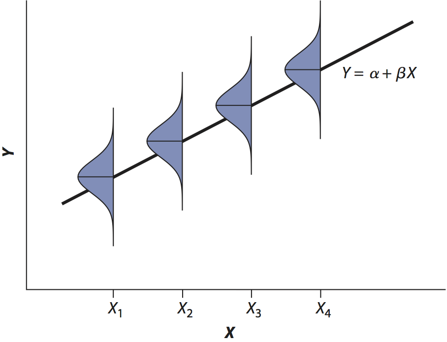

```{r setup, echo=FALSE, message=FALSE, warning=FALSE}
library(tidyverse)
library(cowplot)
library(RcppEigen)
library(plot3D)
library(rethinking)
library(latex2exp)
library(rethinking)

ssPlot <- function(X, Y, b, do.plot = TRUE, do.labels = TRUE){
  n <- length(X)
  SSy <- sum((Y - (X * b + (mean(Y) - b * mean(X)))) ^ 2)
  if (do.labels) {
    main <- paste("b =", sprintf("%.2f", b), "\nSS =", 
                  sprintf("%.2f", SSy))
  } else {
    main <- ""
  }
  if (do.plot) {
    par(cex.lab = 2, cex.main = 2)
    plot(X, Y, type = 'n', main = main)
    points(mean(X), mean(Y), pch = 1, cex = 4, col = 'blue')
    abline(a = mean(Y) - b * mean(X), b = b, col = 'blue')
    for (i in 1:n) {
      segments(X[i], Y[i], X[i], X[i] * b + (mean(Y) - b * mean(X)), 
           col = 'red')
    }
    points(X, Y, pch = 16)
  }
  return(SSy)
}
```

## Notes

## Readings

## Frameworks for inference

1. Analytical
2. Maximum likelihood
3. Resampling
4. Bayesian

## Linear regression

What values of $\theta_1$ and $\theta_2$ provide the best fit line through $Y$ as a function of $X$?

$$Y = \theta_1 + \theta_2 X$$

How do we estimate $\theta_1$ and $\theta_2$?

## Generate data

Generate $n=30$ random data points: $X \sim \mathcal{N}(10, 1)$ and $Y = 2.3 X + \epsilon$, where $\epsilon \sim \mathcal{N}(1, 1)$:

```{r Generate_data}
set.seed(4)
n <- 30
X <- rnorm(n, mean = 10, sd = 1)
Y <- 2.3 * X + rnorm(n, mean = 1, sd = 1)
M <- data.frame(X, Y)
M %>% head()
```

## Generate data

```{r, echo=FALSE}
ggplot(M, aes(X, Y)) + geom_point()
```

## Analytical solution 1

An infinite range of possible slopes ($\theta_1$)

1. All pass through $\left(\bar{X}, \bar{Y}\right)$.
1. Sum of the squared deviations vary continuously.
1. Only one value of $\theta_1$ will minimize the SS.
    - The *Ordinary Least Squares* estimate

## Analytical calculation of $\theta_1$

$$\theta_1 = \frac{\sum\left(X_{i}-\bar{X}\right)\left(Y_{i}-\bar{Y}\right)}{\sum\left(X_{i}-\bar{X}\right)^{2}}$$

Numerator:  Sum of the products of *X* and *Y*

Denominator: Sum of squares of *X*

## Another analytical calculation of $\theta_1$

The covariance of *X* and *Y* divided by the variance of *X*.

$$\theta_1 = \frac{Cov(X, Y)}{s_X^2}$$

$$Cov(X, Y) = \frac{\sum\left(X_{i}-\bar{X}\right)\left(Y_{i}-\bar{Y}\right)}{n - 1}$$

$$s_x^2 = \frac{\sum\left(X_{i}-\bar{X}\right)^{2}}{n - 1}$$

## Analytical calculation of $\theta_0$

Because the OLS line must pass through $\left(\bar{X},\bar{Y}\right)$:

$$\theta_0 = \bar{Y} - \theta_1 \bar{X}$$

## Comparison to correlation

$$r = \frac{\sum\left(X_i - \bar{X}\right)\left(Y_i - \bar{Y}\right)}{\sqrt{\sum\left(X_i - \bar{X}\right)^{2}}\sqrt{\sum\left(Y_i - \bar{Y}\right)^{2}}}$$

$$\theta_1 = \frac{\sum\left(X_{i} - \bar{X}\right)\left(Y_{i} - \bar{Y}\right)}{\sum\left(X_{i} - \bar{X}\right)^{2}}$$

$$\theta_1 = r_{X,Y}\frac{s_Y}{s_X}$$

## Assumptions of OLS

At each *X*, there is a normally distributed population of *Y* observations with a mean at the regression line

- The variance of all *Y* observations is equal. 

No assumptions are made about *X*

- Not that it is normal
- Not that it is randomly sampled
- Think about calibration curves. You set the *X* observations explicitly.

## Normally distributed population of *Y* observations

<center>

</center>

## Minimizing Sums of Squares

```{r echo=FALSE}
plot(X, Y, pch = 16, cex.lab = 2)
```

## Minimizing Sums of Squares

```{r echo=FALSE}
plot(X, Y, pch = 16, cex.lab = 2)
points(mean(X), mean(Y), pch = 1, cex = 4, col = 'blue')
text(9.25, 28, bquote(bar(Y) == .(round(mean(Y), 2))), cex = 2)
text(9.25, 27, bquote(bar(X) == .(round(mean(X), 2))), cex = 2)
```

## Minimizing Sums of Squares

```{r echo=FALSE, results='hide'}
# b = 0
ssPlot(X, Y, 0)
text(9.25, 28, bquote(bar(Y) == .(round(mean(Y), 2))), cex = 2)
```

## Minimizing Sums of Squares

$$SS = \sum\left(Y_i - \hat{Y}\right)^2$$

Where:

- $Y_i$ are the observed values of $Y$
- $\hat{Y}$ are the predicted values of $Y$ for each $X$. (Note analogy between predicted values and sample mean.)

## Minimizing Sums of Squares

```{r echo=FALSE, results='hide'}
# b = 0
ssPlot(X, Y, 0)
text(9.25, 28, bquote(bar(Y) == .(round(mean(Y), 2))), cex = 2)
```

## Minimizing Sums of Squares

```{r echo=FALSE, results='hide'}
# b = 0.5
ssPlot(X, Y, 0.5)
text(9.25, 28, bquote(bar(Y) == .(round(mean(Y), 2))), cex = 2)
```

## Minimizing Sums of Squares

```{r echo=FALSE, results='hide'}
# b = 1
ssPlot(X, Y, 1)
text(9.25, 28, bquote(bar(Y) == .(round(mean(Y), 2))), cex = 2)
```

## Minimizing Sums of Squares

```{r echo=FALSE, results='hide'}
# b = 1.5
ssPlot(X, Y, 1.5)
text(9.25, 28, bquote(bar(Y) == .(round(mean(Y), 2))), cex = 2)
```

## Minimizing Sums of Squares

```{r echo=FALSE, results='hide'}
# b = 2
ssPlot(X, Y, 2)
text(9.25, 28, bquote(bar(Y) == .(round(mean(Y), 2))), cex = 2)
```

## Minimizing Sums of Squares

```{r echo=FALSE, results='hide'}
# b = 2.1
ssPlot(X, Y, 2.1)
text(9.25, 28, bquote(bar(Y) == .(round(mean(Y), 2))), cex = 2)
```

## Minimizing Sums of Squares

```{r}
# Iteratively find the minimum SS
theta_1 <- seq(-10, 10, by = 0.01)

# data.frame to hold output
SumSq <- data.frame(theta_1 = theta_1,
                    SS = numeric(length(theta_1)))
head(SumSq)
```

## Minimizing Sums of Squares

```{r}
# Iterate through slopes
for (i in 1:nrow(SumSq)) {
  theta_1 <- SumSq$theta_1[i]
  SumSq$SS[i] <- ssPlot(X, Y, theta_1, do.plot = FALSE)
}

# Location of minimum SS
minSS.theta_1 <- SumSq$theta_1[which.min(SumSq$SS)]
minSS.SS <- SumSq$SS[which.min(SumSq$SS)]
```

## Minimizing Sums of Squares

```{r echo=FALSE}
plot(SumSq,
     cex.lab = 1.5,
     type = "l", lwd = 2,
     xlab = TeX("$\\theta_1$"),
     ylab = "Sum of Squares")
points(minSS.theta_1, minSS.SS, col = "red", pch = 16, cex = 1.5)
text(-10, 200, paste("b =", minSS.theta_1, "\nSS =", round(minSS.SS, 2)),
     pos = 4, cex = 2)
```

## Analytical solution 2: Matrix algebra

$Y$ is a ($n \times 1$) vector of observed values
$X$ is an ($n \times 2$) matrix of ones followed by observations

$$\theta = (X'X)^{-1} X'Y$$

Where $X'$ is the transpose of $X$ and $X^{-1}$ is the [inverse](See: https://www.mathsisfun.com/algebra/matrix-inverse.html).

```{r}
(X_mat <- matrix(c(rep(1, n), X), ncol = 2))
```

## Analytical solution 2

```{r}
(theta <- (solve(t(X_mat) %*% X_mat)) %*% (t(X_mat) %*% Y))
```

`theta` is a 2 x 1 matrix of coefficients:

$$
\theta=\left[\begin{array}{c}
`r round(theta[1, 1], 3)`\\
`r round(theta[2, 1], 3)`
\end{array}\right]
$$

---

```{r}
lm_fast <- function(X, Y) {
  X_mat <- matrix(cbind(rep(1, length(Y)), X), nrow = length(Y))
  theta <- (solve(t(X_mat) %*% X_mat, tol = 1e-25)) %*% (t(X_mat) %*% Y)
  return(theta)
}

predict_Y <- function(theta, X) {
  X <- as.matrix(X, nrow = length(theta))
  Y_hat <- theta[1, 1] + rowSums(theta[2:nrow(theta), 1] * X)
  return(Y_hat)
}

log_lik <- function(Y, Y_hat) {
  var_hat <- sum((Y - Y_hat)^2) / (length(Y))
  sd_hat <- sqrt(var_hat)
  probs_Y <- dnorm(Y, mean = Y_hat, sd = sd_hat)
  LL <- sum(log(probs_Y))
  return(LL)
}
```

---

```{r}
theta <- lm_fast(X, Y)
Y_hat <- predict_Y(theta, X)
(LL <- log_lik(Y, Y_hat))

fm <- lm(Y~X)
logLik(fm)

X_mat <- matrix(c(rep(1, length(X)), X), ncol = 2)
fm_fast <- fastLmPure(X_mat, as.matrix(Y))
log_lik(Y, fm_fast$fitted.values)
```

---

```{r}
t1 <- Sys.time()

reps <- 10^4
liks <- numeric(length = reps)

load("~/Dropbox/House/Aprob.rda")
n <- nrow(Aprob)

# Add column of 1's for intercept term
X <- as.matrix(cbind(rep(1, n), Aprob[, 2:9]), nrow = n)

set.seed(5)

for (i in 1:reps) {
  Y <- rexp(n, rate = 10)
  
  # Normalize so each row sums to 1.
  fm_fast <- fastLmPure(X, Y)
  liks[i] <- log_lik(Y, fm_fast$fitted.values)
}
Sys.time() - t1
```

---

```{r}
ggplot(as.data.frame(liks), aes(x = 1:length(liks), y = liks)) +
  geom_path()
```

---

```{r}
library(modelr)

fm <- lm(Y ~ X, data = M)
M_aug <- M %>% 
  add_residuals(fm) %>% 
  add_predictions(fm)
M_aug
```

---

```{r echo=FALSE}
M_aug %>% 
  select(-resid) %>% 
  gather(key, value, -X) %>% 
  ggplot() +
  geom_smooth(data = M_aug, aes(X, Y), method = "lm", se = FALSE) +
  geom_point(aes(X, value, color = key)) +
  scale_color_manual(values = c("red", "blue"))
```

---

```{r echo=FALSE}
ggplot(M_aug, aes(resid)) +
  geom_line(stat = "density")
summary(M_aug$resid)
```

## Maximum likelihood

## Minimizing the SS == Maximizing the Likelihood

Minimizing the residual sum of squares is numerically equal to *maximizing* the model likelihood.

## Errors are normally distributed around the regression line

<center>
  
</center>

How would probabilities change for a different slope estimate?

## What is the probability of an observed value given a regression model? 

Define a function to calculate the probability of an observed value $Y_i$ given the mean ($\mu$) and standard deviation ($\sigma$). Default to the standard normal distribution $\mathcal{N}(0,1)$.

$$\phi\left(Y_i\right) = \frac{1}{\sqrt{2\pi\sigma^{2}}} e^{\frac{-\left(Y_i-\mu\right)^{2}}{2\sigma^{2}}}$$

```{r}
normal <- function(Y, mu = 0, sigma = 1) {
  1 / sqrt(2 * pi * sigma ^ 2) * 
    exp((-(Y - mu) ^ 2 / (2 * sigma ^ 2)))
}
```

_Note_: this function is built into R as `dnorm()`.

## Check that our function works

```{r}
normal(0, mu = 0, sigma = 1)
dnorm(0, 0, 1)

normal(1, mu = 0, sigma = 1)
dnorm(1, 0, 1)
```

## Define a model

$$y = \bar{Y} + bX$$

$$b = 0$$

This is a flat line ($b = 0$) through the mean of $Y$.

## Define a model

```{r echo=FALSE, results='hide'}
set.seed(4)
n <- 30
X <- rnorm(n, mean = 10, sd = 1)
Y <- 2.3 * X + rnorm(n, mean = 1, sd = 1)
M <- data.frame(X, Y)

ssPlot(X, Y, b = 0, do.labels = FALSE)
```

## Calculate the predicted values

Just the mean of $Y$ repeated 30 times.

```{r}
Y_bar <- mean(Y)
Y_hat <- rep(Y_bar, length(Y))
Y_hat
```

## Probability of a predicted value of $Y$

$$\phi\left(Y_i\right)=\frac{1}{\sqrt{2\pi\hat{\sigma}^2}} e^{\frac{-\left(Y_i - \mu\right)^{2}}{2\hat{\sigma}^2}}$$

- $\mu =$ the predicted value $\hat{Y}_i$
- Need the estimate of the residual variance $\left(\hat{\sigma}^2\right)$.

## Residual variance

$$\hat{\sigma}^2 = \frac{\Sigma_i\left(Y_i - \hat{Y}_i\right)^2}{n}$$

This is a biased estimate, but that's ok. It is how model likelihoods are calculated in this case. 

$$s^2 = MSE = \frac{n}{n-2}\left(\hat{\sigma}^2\right)$$

For non-small $n$, $s^2 \approx \left(\hat{\sigma}^2\right)$. Here ~7% difference.

## Calculate the estimated residual variance and standard deviation

```{r}
# Estimated variance
var_hat <- sum((Y - Y_hat)^2) / (length(Y))
var_hat
sd_hat <- sqrt(var_hat)
sd_hat
```

## Probability for observed $Y$s

```{r}
# Check the probability for the first Y
normal(Y[1], mu = Y_hat[1], sigma = sd_hat)

# Calculate for all Ys
probs_Y <- normal(Y, mu = Y_hat, sigma = sd_hat)
probs_Y
```

OK. Now what?

## Model Likelihood ($\mathcal{L}$)

For a set of $Y_i$ and parameters ($\Theta$; i.e., slope and intercept) the likelihood of the model is the product of their individual probabilities:

$$\mathcal{L}\left(\left\{ Y_{i}\right\} _{i=1}^{n};\Theta\right) = \prod_{i=1}^{n}\phi\left(Y_{i}; \Theta\right)$$

Evaluate the likelihood function for different values of $\Theta$ to estimate $\mathcal{L}$ for different sets of $\Theta$.

- Maximize $\mathcal{L}$ and you will have the best set of parameter estimates.

## Model Likelihood ($\mathcal{L}$)

It's usually easier to minimize the (natural) log of the likelihood function. The log-likelihood is easier to deal with mathematically.

Log both sides of the equation:

$$\log\left(\mathcal{L}\left(\left\{ Y_{i}\right\} _{i=1}^{n};\Theta\right)\right) = \log\left(\prod_{i=1}^{n}\phi\left(Y_{i};\Theta\right)\right)$$

## Model Likelihood ($\mathcal{L}$)

Taking advantage of the algebraic rules associated with logs (the log of the products equals the sum of the logs):

$$\log\left(\mathcal{L}\left(\left\{ Y_{i}\right\} _{i=1}^{n};\Theta\right)\right) = \sum_{i=1}^{n} \log\left(\phi\left(Y_{i};\Theta\right)\right)$$

So we just need to sum the log-likelihoods to get the overall model likelihood. 

_Note_: `log()` is _natural_ log.

## Model Likelihood ($\mathcal{L}$)

```{r}
# Product of the individual likelihoods
prod(probs_Y)
```

This is a very small number (and we only have 30 observations).

```{r}
# Sum of the log-likelihoods
sum(log(probs_Y))
```

This number is easier to deal with.

## Likelihood from linear regression with $b = 0$

Fit a linear model (`lm()`) with only an intercept (`~ 1`) and use the built-in function `logLik()` to extract the log-likelihood.

```{r}
fm <- lm(Y ~ 1)
ll <- logLik(fm)
ll
exp(ll)
```

## Maximizing the log-Likelihood

Function to calculate the log-likelihood. Input the slope ($b$) and observed values of $X$ and $Y$. Return the log-likelihood.

```{r log_lik}
log_lik <- function(b, X, Y){
  Y_bar <- mean(Y)
  X_bar <- mean(X)
  a <- Y_bar - b * X_bar
  Y_hat <- a + b * X
  var_hat <- sum((Y - Y_hat)^2) / (length(Y))
  sd_hat <- sqrt(var_hat)
  probs_Y <- normal(Y, mu = Y_hat, sigma = sd_hat)
  return(sum(log(probs_Y)))
}
```

## Maximizing the log-Likelihood

For a range of $b$ from -10 to 10 in increments of 0.01, calculate the log-likelihood of the model. Save to a variable called `lls`. Then find the maximum value of `lls`, the associated $b$ and log-likelihood.

```{r}
b <- seq(-10, 10, by = 0.01)
lls <- numeric(length(b))
for (i in 1:length(b)) {
  lls[i] <- log_lik(b[i], X, Y)
}

# Location of maximum log-likelihood
max.ll <- lls[which.max(lls)]

# Slope at maximum log-likelihood
b_hat <- b[which.max(lls)]
```

## Maximizing the log-Likelihood

```{r echo=FALSE}
plot(lls ~ b,
     cex.lab = 1.5,
     type = "l", lwd = 2,
     xlab = "Slope (b)",
     ylab = "log-Likelihood")
points(b_hat, max.ll, col = "red", pch = 16, cex = 1.5)
text(-10, -60, paste("b =", b_hat, "\nlogLik =", round(max.ll, 2)),
     pos = 4, cex = 2)
```

## Maximizing the log-Likelihood

```{r}
max.ll
fm <- lm(Y ~ X) # Fit model with slope and intercept
logLik(fm)      # Use built-in function to extract log-likelihood
```

The values are not identical, because we only calculated $b$ in increments of 0.01.

*Can we be more accurate?*

## Optimizing the log-Likelihood

`optimize()` finds the maximum or minimum of a function given a range of values to test (`interval`).

```{r}
optimize(log_lik, interval = c(-10, 10),
         X = X, Y = Y,
         maximum = TRUE)
logLik(fm)
```

## Bayesian

What priors for intercept ($\theta_0$) and slope ($\theta_1$)?

```{r echo=FALSE, fig.height=4}
p1 <- M %>% 
  ggplot(aes(X, Y)) +
  geom_point()
x <- seq(-50, 50, length = 100)
p2 <- data_frame(x = x, y = dnorm(x, 0, 10)) %>% 
  ggplot(aes(x, y)) +
  geom_line() +
  labs(x = "value", y = "Probability",
       title = TeX("$N(0, 10)$"))
plot_grid(p1, p2, ncol = 2)
```

## Bayesian

```{r Bayes_regression, cache=TRUE, message=FALSE}
fm <- map2stan(
  alist(
    Y ~ dnorm(mu, sigma),
    mu <- theta_0 + theta_1 * X,
    theta_0 ~ dnorm(0, 10),
    theta_1 ~ dnorm(0, 10),
    sigma ~ dcauchy(0, 2)
  ),
  data = M,
  WAIC = FALSE,
  iter = 10^4,
  warmup = 1000)
```

## Bayesian

```{r, echo=FALSE}
plot(fm)
```

## Bayesian

```{r, echo=FALSE}
post <- extract.samples(fm) %>% as_data_frame() %>% 
  select(-sigma)
post %>%
  gather(variable, value) %>% 
  ggplot(aes(value)) +
  geom_line(stat = "density") +
  facet_grid(. ~ variable)
```

## Bayesian

```{r}
precis(fm, digits = 4)
coef(lm(Y ~ X, data = M))
```

## Bayesian

```{r echo = FALSE}
post_samp <- post %>%
  sample_n(200)
ggplot() +
  geom_abline(data = post_samp, aes(intercept = theta_0, slope = theta_1),
              alpha = 0.2) +
  geom_point(data = M, aes(X, Y), color = "red", size = 2.5)
```

## Key features

- Analytical solutions are fast, hand-calculable
    - Unavailable for complex models (e.g., hierarchical models)
- Analytical and ML estimates will converge given enough precision
- Bayesian estimates can include prior knowledge
- Bayesian estimates will converge on ML estimates for sufficiently flat priors and/or sufficient data

