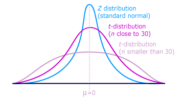

```{r setup, echo=FALSE, message=FALSE, warning=FALSE}
library(tidyverse)
library(cowplot)
library(rethinking)
library(latex2exp)
library(BEST)
```

## Notes

## Readings

## Horned lizard predation

<center>

</center>

## Horned lizard predation

```{r message=FALSE}
HL <- read_csv("../data/HornedLizards.csv")
glimpse(HL)
HL %>% group_by(group) %>% tally()
```

## Horned lizard predation

```{r echo=FALSE, warning=FALSE}
HL %>% 
  ggplot(aes(horn_length)) +
  geom_histogram(bins = 30) +
  facet_grid(group ~ .) +
  labs(x = "Horn Length (mm", y = "Count")
```

## Summarize

```{r}
HL %>% group_by(group) %>% 
  summarize(horn_mean = mean(horn_length),
            horn_sd = sd(horn_length))
sum(!complete.cases(HL))
```

## Summarize

Drop rows with any `NA`s:

```{r}
HL <- HL %>% drop_na()
```

Summarize:

```{r}
HL %>% group_by(group) %>% 
  summarize(horn_mean = mean(horn_length),
            horn_sd = sd(horn_length))
```

## Are the means different?

Horn length in live horned lizards: `r round(mean(HL$horn_length[HL$group == "alive"]), 2)` mm

Horn length in dead horned lizards: `r round(mean(HL$horn_length[HL$group == "dead"]), 2)` mm

Imagine you collected 100 live horned lizards and randomly assigned 50 to each of two groups. Do you think they would have the same mean horn length? How different do you think the means would be? Think about how the variability among individual horn length measuremnts would affect your intuition here.

> The first principle is that you must not fool yourself – and you are the easiest person to fool. -Feynman

## How large of a difference do we expect to see from sampling error?

<div class="columns-2">
<center>

<br />
<br />
<br />
</center>

- Imagine a distribution of horn lengths for a population of horned lizards (mean = 24, sd = 3)
- Pull out two groups of 50 from this same distribution
- How different are they?


</div>

## How large of a difference do we expect to see from sampling error?

```{r}
set.seed(883231)
mu.horn <- 24 #mean
sd.horn <- 3 #standard deviation
n.iter <- 10000 #number of iterations
n.samp <- 50 #number in each sample
sim.diff <- data_frame(dd=numeric(length=n.iter)) #set up vector to hold output  

for (zz in 1:n.iter){
  s1 <- rnorm(n.samp, mu.horn, sd.horn) #sample 1
  s2 <- rnorm(n.samp, mu.horn, sd.horn) #sample 2
  sim.diff[zz,'dd'] <- mean(s1) - mean(s2) #difference in means
}

```

## How large of a difference do we expect to see from sampling error?

<div class="columns-2">

```{r message=FALSE, fig.width=3.5, fig.height=3.5}
ggplot(sim.diff, aes(x=dd)) +
  geom_histogram()

```

- Imagine a distribution of horn lengths for a population of horned lizards (mean = 24, sd = 3)
- Pull out two groups of 50 from this same distribution
- How different are they?
</div>

## How large of a difference do we expect to see from sampling error?

<div class="columns-2">
```{r message=FALSE, fig.width=3.5, fig.height=3.5}
ggplot(sim.diff, aes(x=dd)) +
  geom_histogram()
```

Horn length in live horned lizards: `r round(mean(HL$horn_length[HL$group == "alive"]), 2)` mm

Horn length in dead horned lizards: `r round(mean(HL$horn_length[HL$group == "dead"]), 2)` mm

Difference: `r round(mean(HL$horn_length[HL$group == "alive"]), 2) - round(mean(HL$horn_length[HL$group == "dead"]), 2)`

Are the means different?
</div>

## Frameworks for inference

1. Analytical
2. Maximum likelihood
3. Resampling
4. Bayesian

## Analytical: T-test

<div class="columns-2">
<center>

<br />
<br />
<br />
</center>

- Test statistic based on means, standard deviations, and sample size 
- Follows a $t$ distribution
- Like a normal distribution that accounts for sample size
- We won't derive the $t$ distribution

</div>

## ML Comparison

*Model 1*: Data drawn from one distribution

*Model 2*: Data drawn from distributions with 2 different means

Compare the models with a likelihood ratio (Bayes Factor):

$$BF = \frac{Pr[Model~2]}{Pr[Model~1]}$$

## Sum of Squares and Variance

Sum of the squared differences between each observation and the mean:

$$SS = \sum^{n_1}_{i=1}\left(y_{i} - \bar{y}\right)^2$$

Sample variance:

$$s^2 = \frac{1}{n - 1}\left(\sum^{n_1}_{i=1} \left(y_i - \bar{y}\right)^2\right)$$


## Data drawn from one distribution

Single sample variance:

$$s^2 = \frac{1}{n - 1}\left(\sum^{n_1}_{i=1} \left(y_i - \bar{y}\right)^2\right)$$

Shared variance:

$$\hat{\sigma}^2_1 = \frac{1}{n_1 + n_2}\left(\sum^{n_1}_{i=1}\left(y_{1i} - \bar{\bar{y}}\right)^2 +  \sum^{n_2}_{i=1} \left(y_{2i} - \bar{\bar{y}}\right)^2 \right)$$

where $\bar{\bar{y}}$ is the grand mean.

## Data drawn from one distribution

Likelihood of the $y$s being drawn from the same distribution:

$$\mathcal{L}\left(\hat{\mu}, \hat{\sigma}^2_1|y\right) = \frac{1}{\left(2\pi \hat{\sigma}^2_1\right)^\left(\frac{n_1 + n_2}{2}\right)}e^{\left(-\frac{n_1 + n_2}{2}\right)}$$

## Data drawn from distributions with 2 different means

Assume equal variances but different means.

$$\hat{\sigma}^2_2 = \frac{1}{n_1 + n_2}\left(\sum^{n_1}_{i=1}\left(y_{1i} - \bar{y}_1\right)^2 +  \sum^{n_2}_{i=1} \left(y_{2i} - \bar{y}_2\right)^2 \right)$$

$$\mathcal{L}\left(\hat{\mu}_1, \hat{\mu}_2, \hat{\sigma}^2_2|y\right) = \frac{1}{\left(2\pi \hat{\sigma}^2_2\right)^\left(\frac{n_1 + n_2}{2}\right)}e^{\left(-\frac{n_1 + n_2}{2}\right)}$$

## ML Comparison

*Model 1*: Data drawn from one distribution

*Model 2*: Data drawn from distributions with 2 different means

Compare the models with a likelihood ratio (Bayes Factor):

$$BF = \frac{Pr[Model~2]}{Pr[Model~1]} = \frac{\mathcal{L}\left(\hat{\mu}_1, \hat{\mu}_2, \hat{\sigma}^2_2|y\right)}{\mathcal{L}\left(\hat{\mu}, \hat{\sigma}^2_1|y\right)} = \left(\frac{\hat{\sigma}^2_2}{\hat{\sigma}^2_1}\right)^{-\frac{n_1 + n_2}{2}}$$

More in Problem Set 5.

## Resampled difference of means

```{r resampled_difference, cache=TRUE}
set.seed(8734)
reps <- 10000
diffs <- numeric(length = reps)

diffs[1] <- mean(HL$horn_length[HL$group == "alive"]) -
  mean(HL$horn_length[HL$group == "dead"])

for (i in 2:reps) {
  HL$shuffle <- sample(HL$horn_length)
  diffs[i] <- mean(HL$shuffle[HL$group == "alive"]) -
  mean(HL$shuffle[HL$group == "dead"])
}
```

## Difference of means

```{r echo=FALSE}
data_frame(diffs) %>% 
  ggplot(aes(diffs)) + 
  geom_histogram(bins = 30) +
  geom_vline(xintercept = diffs[1], color = "red") +
  labs(x = "Difference (mm)", y = "Count")
```

## Bayesian

Prepare data

```{r message=FALSE}
HL <- read_csv("../data/HornedLizards.csv") %>% 
  drop_na() %>% 
  mutate(group = coerce_index(group)) %>% 
  as.data.frame()
str(HL)
```

## Bayesian

```{r}
mean(HL$horn_length)
```

Prior for group means (alive, dead) ~  $\mathcal{N}(\mu = 23.9, \sigma = 5)$

- ~95% of probability lies between 13.9 and 33.9
- Estimate posterior distribution of each group simultaneously

```{r echo=FALSE, fig.height = 2}
data_frame(x = seq(10, 38, length = 100),
           y = dnorm(x, 23.9, 5)) %>% 
  ggplot(aes(x, y)) +
  geom_line() +
  labs(x = "Prior for Horn Length (mm)")
```


## Bayesian

```{r bayes_mean_2, cache=TRUE}
fm2 <- map2stan(
  alist(
    horn_length ~ dnorm(mu, sigma),
    mu <- a[group],
    a[group] ~ dnorm(23.9, 5),
    sigma ~ dcauchy(0, 2)
  ),
  data = HL,
  iter = 1e5, warmup = 1e3)
```

## Bayesian

```{r echo=FALSE}
plot(fm2)
```

## Bayesian

```{r echo=FALSE}
post <- extract.samples(fm2)
alive <- post$a[, 1]
dead <- post$a[, 2]

data_frame(alive, dead) %>%
  gather(group, horn) %>% 
  ggplot(aes(horn, color = group)) +
  geom_line(stat = "density", size = 1.5) +
  labs(x = "Horn Length (mm)")
```

## Bayesian

```{r}
precis(fm2, depth = 2, digits = 4)
HL %>% group_by(group) %>% 
  summarize(horn_mean = mean(horn_length))
```

## Bayesian

```{r echo=FALSE, fig.height = 2}
diff <- alive - dead
hdint <- hdi(diff)

data_frame(diff) %>% 
  ggplot(aes(diff)) +
  geom_line(stat = "density", size = 1.5) +
  geom_vline(xintercept = hdint[1], color = "lightblue", size = 1.5) +
  geom_vline(xintercept = hdint[2], color = "lightblue", size = 1.5) +
  labs(x = "Difference (alive - dead; mm)")
```

95% credible interval of difference

```{r}
hdi(diff)
```
