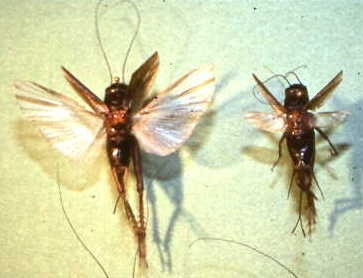
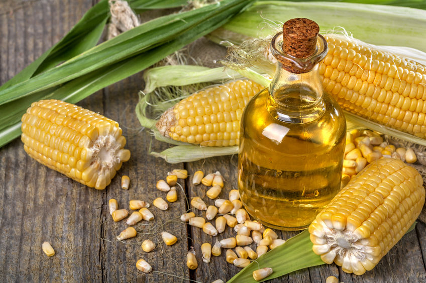

```{r setup, echo=FALSE, message=FALSE, warning=FALSE}
library(tidyverse)
library(cowplot)
```

## Notes

1. Understand distinction between parameter estimate and interval estimate and hypothesis test
    - Parameter estimation, interval estimation, hypothesis testing
    - Real world examples
    - Back to t-test / lm example for parameter estimation only
        - Equality of estimates

Examples

- BC screening/deaths

## Readings

## Estimation

1. Parameter (point) estimation
    - Given a model, with unknown parameters ($\theta_0$, $\theta_1$, ..., $\theta_k$), how do we estimate values of those parameters?
2. Interval estimation
    - How do we quantify the incertainty associated with parameter estimates?
3. Hypothesis testing
    - How do we test a hypothesis about a parameter estimate?

## Example: Is normal body temperature 98.6 F?

Resting body temperature for a sample of healthy humans (*n* = 25):

```{r echo=FALSE, message=FALSE, fig.height = 3}
HBT <- read_csv("../data/HumanBodyTemp.csv")

HBT %>% 
  ggplot(aes(temp)) +
  geom_histogram(bins = 10) +
  geom_vline(xintercept = 98.6, color = "steelblue", size = 2.5) +
  labs(x = "Temperature (F)", y = "Count")
```

## Example: Wing Dimorphic Crickets

> Do long-winged crickets have a higher resting metabolic rate than short-winged crickets?

<div class="columns-2">

<center>

<br />
<br />
<br />
</center>

Controlling for body mass,

- Metabolic rates do not differ
- Average metabolic rate of long-wings is higher
- Average metabolic rate of long-wings is lower

</div>

## Example: Genetics of Corn Oil Content

> Which set of loci best predicts oil content in corn kernels?

<div class="columns-2">

<center>
<br />

<br />
<br />
<br />
</center>

- Heritability of corn oil content is 0
- Different possible combinations of SNPs
- All additive
- Dominance
- Epistasis
- Structural variants

</div>

## Horned lizard predation

<center>

</center>

## Horned lizard predation

```{r echo=FALSE, warning=FALSE, message=FALSE}
HL <- read_csv("../data/HornedLizards.csv") %>% 
  drop_na()

HL %>% 
  ggplot(aes(horn_length)) +
  geom_histogram(bins = 30) +
  facet_grid(group ~ .) +
  labs(x = "Horn Length (mm)", y = "Count")
```

## Estimation

1. Parameter (point) estimation
    - What are the estimates for mean horn length in live and dead horned lizards?
2. Interval estimation
    - What are the confidence intervals around those estimates?
3. Hypothesis testing
    - Is a difference that large likely to happen by chance alone?

## 1. Estimate of group means

```{r}
HL %>% group_by(group) %>% 
  summarize(horn_mean = mean(horn_length),
            horn_SEM = sd(horn_length) / length(horn_length))
```

## 2. 95% confidence interval of group means

Using Mean $\pm$ 2 $\times$ SEM:

- Alive: 24.28 (95% CI = `r 24.28 - 2 * 0.017` -- `r 24.28 + 2 * 0.017`)
- Dead: 21.99 (95% CI = `r 21.99 - 2 * 0.09` -- `r 21.99 + 2 * 0.09`)

## 3a. *t*-test for equality of means {.smaller}

```{r}
t.test(horn_length ~ group, data = HL, var.equal = TRUE)
```

## 3b. Linear model for equality of means {.smaller}

```{r}
fm <- lm(horn_length ~ group, data = HL)
summary(fm)
```

Each line contains a hypothesis test of estimate = 0.
