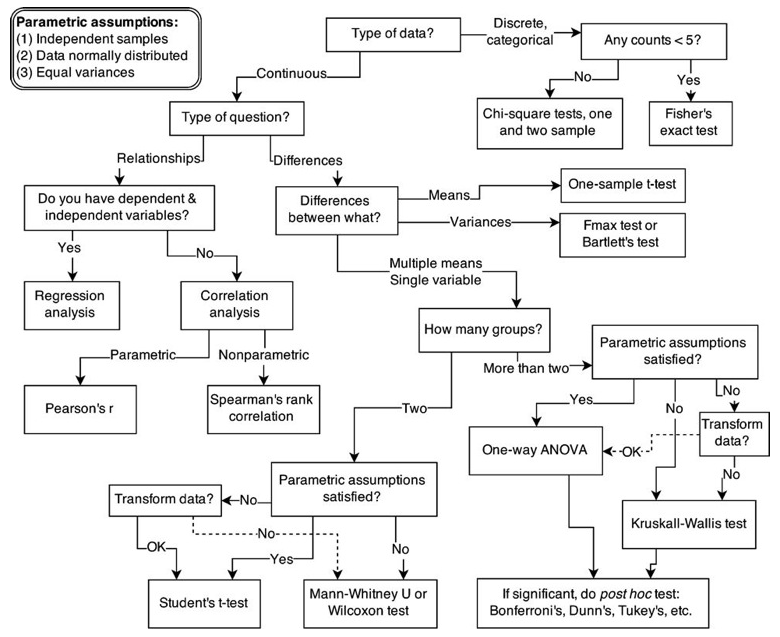
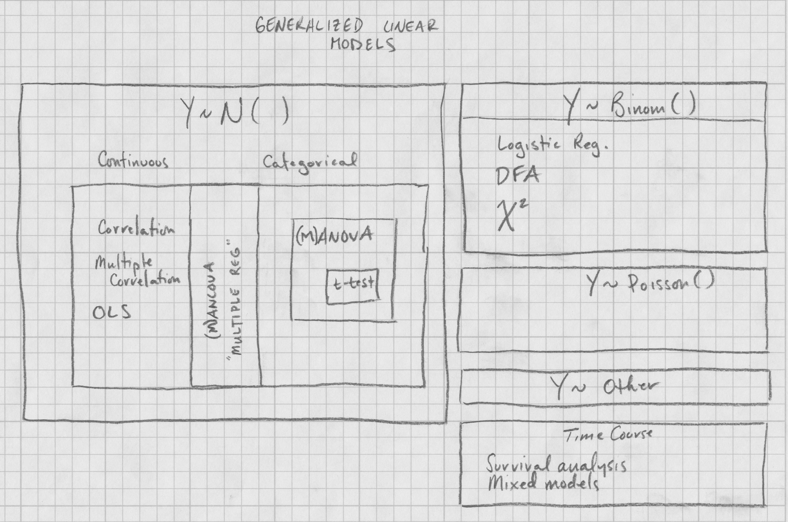

```{r setup, echo=FALSE, message=FALSE, warning=FALSE}
library(tidyverse)
library(cowplot)
```

## Reading

## Notes

## *Generalized* linear models

- A flexible regression method for prediction of *outcome* variables by zero (mean only), one, or more *predictors*
    - Predictors can be categorical (factors) or continuous
- "Named" tests (*t*, ANOVA, OLS, etc.) are really just specific kinds of linear models.
    - Learn a general framework for fitting, and don't worry as much about names

**All of the rest of this class will concern linear models in one way or another.**

## What we want to avoid

<center>

</center>

## What we want to encourage

- Data exploration through visualization
- Development of appropriate *models*
- Fit and compare models
- Make inferences

<center>

</center>

## *Generalized* linear models

$$\mbox{Outcome variable(s)} \sim \mbox{Predictor variable(s)} + \mbox{Error}$$

Distribution of the outcome variable(s) can be:

1. Normal (Gaussian)
1. Binomial
1. Poisson
1. Lots and lots of others

## General equation form of GLMs

$$Y = \beta_0 + \beta_1X_1 + \beta_2X_2 + \dots + \beta_kX_k$$

$Y$ follows some distribution (e.g., normal or binomial)

- Most often normal in life sciences
- $X_k$  are some combination of continuous and categorical predictors.
- $\beta_0$ is the intercept term (optional), the value when all other $\beta = 0$.
- $\beta_k$ are the parameter estimates for the $X$.
- Relationship between $Y$ and $X$s is linearized by a *link function*.

## GLMs with 1 normally distributed outcome variable | a.k.a., "General Linear Models"

1. Continuous ~ $\ge$ 1 Continuous:  **OLS, correlation (Pearson r), multiple correlation (R)**
1. Continuous ~ $\ge$ 1 Categorical: **ANOVA, *t*-test**
1. Continuous ~ 1 Continuous + 1 Categorical: **ANCOVA**
1. Continuous ~ $\ge$ 1 Continuous + $\ge$ 1 Categorical: **Multiple regression**

## GLMs with >1 normally distributed outcome variables | a.k.a. "General Linear Models"

1. Continuous ~ Continuous: **Canonical correlation**
1. Continuous ~ Categorical: **MANOVA**
1. Continuous ~ Categorical + Continuous: **MANCOVA, Hotelling's T^2^**

## Hierarchy of GLMs

<center>

</center>

## Quiz 07-1

Complete Quiz 07-1

Watch Lecture 07-2
