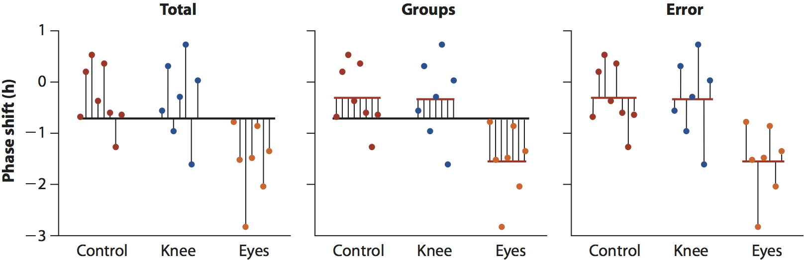

```{r setup, echo=FALSE, message=FALSE, warning=FALSE}
library(tidyverse)
library(cowplot)
source("Shade_Distributions.R")
```

## Reading

## Notes

## Prediction with categorical variables

We have done prediction with only two groups (levels)

- Horned lizards example
- Are the means different?

Now predict with three or more groups

- Is *at least* one mean different?
- Then, *which* mean(s) is/are different

## ANOVA

A more general version of a two-sample *t*-test for *k* groups:

- H~0~: $\mu_{1}=\mu_{2}=\mu_{3}\dots=\mu_{k}$
- H~A~: At least one mean is different (but we won't know which yet)

One-way ANOVA: a single categorical variable

- We will generalize to more variables later

## "Analysis of Variance"

Some total variability in *Y*:

1. Part explained by group membership
1. Part remains unexplained ("error" or "residual")

$F$-statistic is the ratio of the two.

## Does bright light treatment alleviate jet lag symptoms?

FIXME more intro here

## Does bright light treatment alleviate jet lag symptoms?

```{r echo=FALSE}
JL <- read_csv("../data/JetLag.csv")
set.seed(2)
ggplot(JL, aes(x = Treatment, y = Shift)) +
  geom_point(position = position_jitter(width = 0.1)) +
  xlab("Light Treatment") +
  ylab("Shift in Circadian Rhythm (h)")
```

## Compare group means and standard deviations

```{r}
JL %>% group_by(Treatment) %>%
  summarise(mean(Shift), sd(Shift))
```

## Compare group means and standard errors

```{r}
ggplot(JL, aes(x = Treatment, y = Shift)) +
  geom_point(position = position_jitter(width = 0.1)) +
  xlab("Light Treatment") +
  ylab("Shift in Circadian Rhythm (h)") +
  stat_summary(fun.y = mean, geom = "point", size = 3, color = "red") + 
  stat_summary(fun.data = mean_se, geom = "errorbar", width = 0.1,
               color = "red", size = 0.7)
```

## ANOVA as a Linear Model {.smaller}

```{r}
fm_lm <- lm(Shift ~ Treatment, data = JL)
summary(fm_lm)
```

## Parameter estimates

```
## Coefficients:
##               Estimate Std. Error t value Pr(>|t|)
## (Intercept)   -0.30875    0.24888  -1.241  0.22988
## Treatmenteyes -1.24268    0.36433  -3.411  0.00293
## Treatmentknee -0.02696    0.36433  -0.074  0.94178
```

1. `(Intercept)`: Mean for 1st level of factor
1. `Treatmenteyes`: Adjustment from `(Intercept)` for eyes group (Intercept + Treatmenteyes)
1. `Treatmentknee`: Adjustment from `(Intercept)` for knee group (Intercept + Treatmentknee)

*t*-tests and *P* values are suggestive of significant differences, but we need to look at the overall ANOVA first.

## ANOVA table from a Linear Model

```{r}
anova(fm_lm)
```

*P* = 0.004 for the overall ANOVA.

It is possible to have a significant parameter estimate an a non-significant overall ANOVA.
  - Nothing more to do.
  - No post hoc test

## Visualizing ANOVA

<center>

</center>

$$F = \frac{\mbox{Between Group Variation}}{\mbox{Within Group Variation}}$$

## *F* distribution

Two different degrees of freedom:

- Numerator: *k* groups - 1
- Denominator: *N* - *k*

```{r echo=FALSE}
JL %>% group_by(Treatment) %>% tally()
```

## Shape of the *F*-distribution

```{r echo=TRUE}
shade_F(0.05, df1 = 2, df2 = 19, vline = 7.28) +
  geom_vline(xintercept = 7.28, color = "blue")
```

## Parts of an ANOVA table

```{r echo=FALSE}
anova(fm_lm)
```

- `Sum Sq`: Variability accounted for by that part of the ANOVA
- `Mean Sq`: `Sum Sq` / `Df`
- `F value`: `Mean Sq` Treatment / `Mean Sq` Residual
- `Pr(>F)`: *P*-value for the *F*-test of that variable

## Role of variation

Large values of $F$ are more likely to be significant.

$F$ is a ratio:

$$F = \frac{\mbox{MS}_{group}}{\mbox{MS}_{error}}$$

What role does within vs. between group variation have in determining $F$?

## Post hoc tests for ANOVA

Significant ANOVA (*P* = 0.004) only says that at least one mean is different.

Many options are available for post hoc (unplanned) comparisons:

- Scheffé test
- Duncan's multiple range test
- Fisher's least significant difference test
- Newman-Keuls test
- Tukey-Kramer test (Tukey's Honestly Significant
Difference)

We'll use the Tukey-Kramer test
- `TukeyHSD()` in R

## Tukey-Kramer test

- Assumes that we have already performed an ANOVA and rejected the null hypothesis
    - If the overall ANOVA is not significant, then a post hoc test makes no sense.
- The familywise error rate (FWER) with a Tukey-Kramer test is no larger than $\alpha$.
    - FWER is the overall probability of a Type I error
- Tukey-Kramer test makes all the same assumptions as ANOVA.
    - Defaults to all pairwise combinations of levels

## Tukey-Kramer test in R

```{r}
TukeyHSD(fm_lm)
```

## Alternate Tukey-Kramer: `multcomp` library {.smaller}

```{r}
tukey <- glht(fm_lm, linfct = mcp(Treatment = "Tukey"))
summary(tukey)
```

## More fine-grained tests {.smaller}

```{r}
post_hoc <- glht(fm_lm,
                 mcp(Treatment = c("eyes - control = 0",
                                   "knee - control = 0")))
summary(post_hoc)
```

## Post-hoc tests

## Quiz 07-2

Complete Quiz 07-2

Watch Lecture 07-3
