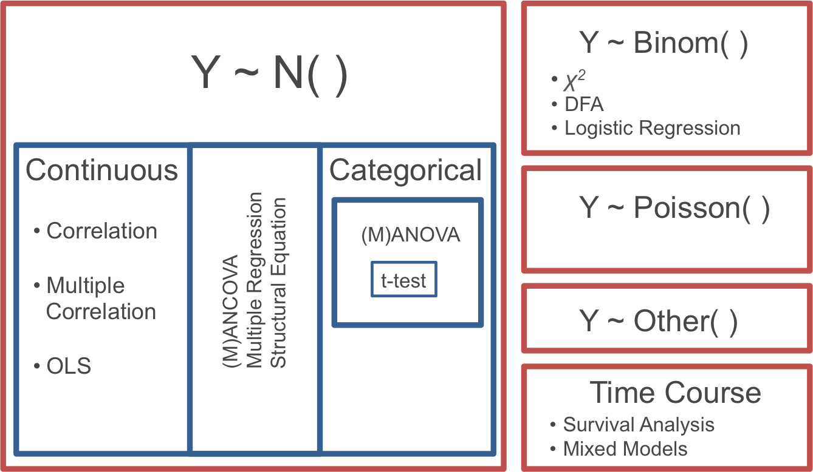
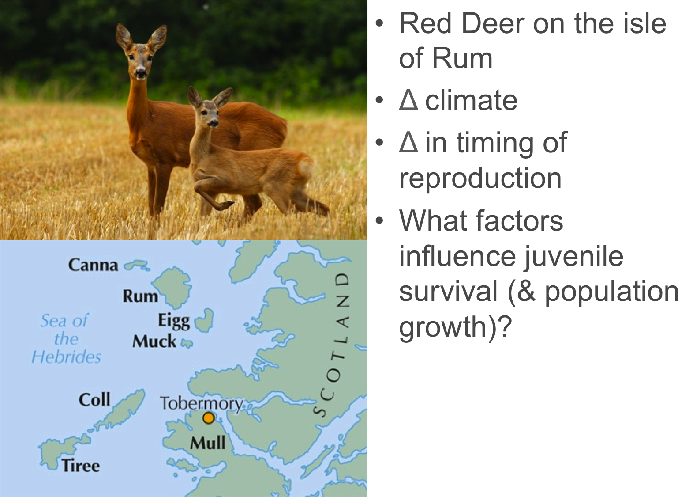
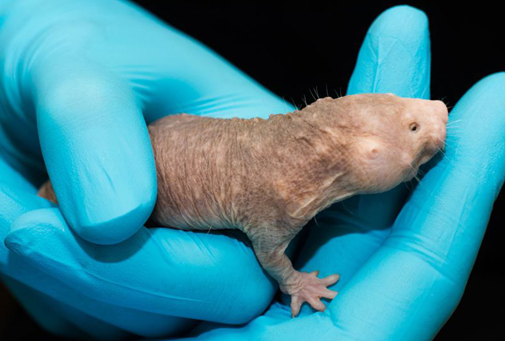

```{r setup, echo=FALSE, message=FALSE, warning=FALSE}
library(tidyverse)
library(cowplot)
library(wesanderson)
library(knitr)
knitr::opts_chunk$set(cache = TRUE)
library(rethinking)
```

## Hierarchy of GLMs

<center>

</center>

## Problem

<center>

</center>

## Prediction

> Outcome: Juvenile Survival

<div class="columns-2">

Possible predictors:

- Birth date  
- Birth mass
- Year
- Sex
- Maternal fecundity
- Maternal reproductive status

<br />

- Maternal age
- Population size
- Temperature (min, max, ave...)
- Rainfall
- Wind speed
- ...

</div>

## Mixed predictors

Ultimately we will mix arbitrary numbers of categorical and continuous predictors:

- Start thinking beyond "slopes" for continuous predictors
    - How many units of change in the outcome results from a 1 unit increase in the predictor?
    
For now:

- One categorical predictor
- One continuous predictor ("covariate")

## Energy expenditure in naked mole rats

<center>

</center>

## Energy expenditure in naked mole rats

```{r echo=FALSE}
data(MoleRats, package = "abd")
M <- MoleRats
M$caste <- factor(as.numeric(M$caste), labels = c("Non-worker", "Worker"))
names(M) <- c("Caste", "Mass", "Energy")
ggplot(M, aes(x = Mass, y = Energy)) +
  geom_point(size = 4) +
  labs(x = "ln Body Mass (g)", y = "ln Daily Energy Expenditure (kJ)")
```

## Energy expenditure in naked mole rats

```{r echo=FALSE}
ggplot(M, aes(x = Mass, y = Energy, color = Caste)) +
  geom_point(size = 4) +
  scale_color_manual(values = wes_palette("Cavalcanti")) +
  theme(legend.justification = c(0, 1), legend.position = c(0, 1)) +
  labs(x = "ln Body Mass (g)", y = "ln Daily Energy Expenditure (kJ)")
```

## Energy expenditure in naked mole rats

*ANOVA*:

- Compare mean energy expenditure for non-workers vs. workers
- Ignores the linear relationships with body mass

*Linear regression*:

- Predicts energy expenditure from body mass alone
- Ignores castes, which appear to have different mass-specific energy expenditure

**Account for *both* body mass and caste in predicting energy expenditure**

## Analysis of covariance

1. One categorical predictor
1. One continuous predictor (the *covariate*): allowed to covary with the response variable

## Fit different models to these data

1. Mean (overall mean, no body mass)
1. ANOVA (group mean, no body mass)
1. OLS regression (body mass only, no grouping)
1. ANCOVA, intercepts varying

## 1: Mean

```{r}
fm1 <- lm(Energy ~ 1, data = M)
```

```{r echo=FALSE}
M <- M %>% mutate(pred1 = predict(fm1))
ggplot(M, aes(x = Mass, y = Energy, color = Caste)) +
  geom_point(size = 4) +
  geom_line(aes(x = Mass, y = pred1), lwd = 2,
            color = wes_palette("Cavalcanti")[5]) +
  scale_color_manual(values = wes_palette("Cavalcanti")) +
  theme(legend.justification = c(0, 1), legend.position = c(0, 1)) +
  labs(x = "ln Body Mass (g)", y = "ln Daily Energy Expenditure (kJ)")
```

## 1: Mean

```{r}
summary(fm1)
```

## 2: ANOVA

```{r}
fm2 <- lm(Energy ~ Caste, data = M)
```

```{r echo=FALSE}
M <- M %>% mutate(pred2 = predict(fm2))
ggplot(M, aes(x = Mass, y = Energy, color = Caste)) +
  geom_point(size = 4) +
  geom_line(aes(x = Mass, y = pred2, color = Caste), lwd = 2) +
  scale_color_manual(values = wes_palette("Cavalcanti")) +
  theme(legend.justification = c(0, 1), legend.position = c(0, 1)) +
  labs(x = "ln Body Mass (g)", y = "ln Daily Energy Expenditure (kJ)")
```

## 2: ANOVA {.smaller}

```{r}
summary(fm2)
```

## 3: OLS regression

```{r}
fm3 <- lm(Energy ~ Mass, data = M)
```

```{r echo=FALSE}
M <- M %>% mutate(pred3 = predict(fm3))
ggplot(M, aes(x = Mass, y = Energy, color = Caste)) +
  geom_point(size = 4) +
  geom_line(aes(x = Mass, y = pred3, group = 1), lwd = 2,
            color = wes_palette("Cavalcanti")[5]) +
  scale_color_manual(values = wes_palette("Cavalcanti")) +
  theme(legend.justification = c(0, 1), legend.position = c(0, 1)) +
  labs(x = "ln Body Mass (g)", y = "ln Daily Energy Expenditure (kJ)")
```

## 3: OLS regression {.smaller}

```{r}
summary(fm3)
```

## 4: ANCOVA, intercepts varying

```{r}
fm4 <- lm(Energy ~ Mass + Caste, data = M)
```

```{r echo=FALSE}
M <- M %>% mutate(pred4 = predict(fm4))
ggplot(M, aes(x = Mass, y = Energy, color = Caste)) +
  geom_point(size = 4) +
  geom_line(aes(x = Mass, y = pred4, color = Caste), lwd = 2) +
  scale_color_manual(values = wes_palette("Cavalcanti")) +
  theme(legend.justification = c(0, 1), legend.position = c(0, 1)) +
  labs(x = "ln Body Mass (g)", y = "ln Daily Energy Expenditure (kJ)")
```

## 4: ANCOVA, intercepts varying {.smaller}

```{r}
summary(fm4)
```

## 4: ANCOVA, intercepts varying

```
Coefficients:
            Estimate Std. Error t value Pr(>|t|)
(Intercept) -0.09687    0.94230  -0.103   0.9188
Mass         0.89282    0.19303   4.625 5.89e-05
CasteWorker  0.39334    0.14611   2.692   0.0112
```

- `(Intercept)`: Intercept for non-workers
- `Mass`: Slope for both groups
- `CasteWorker`: *Offset* for the Worker group (difference in intercepts)

## Fit different models to these data

1. Mean (overall mean, no body mass)
1. ANOVA (group mean, no body mass)
1. OLS regression (body mass only, no grouping)
1. ANCOVA, intercepts varying

> Which model is best?

Model comparison in a few weeks...

## Bayesian approach

Data setup:

```{r echo=FALSE}
# Drop predicted data columns
M <- M %>% 
  select(-contains("pred"))
```

```{r}
M_bayes <- M %>% 
  mutate(Caste_Worker = if_else(Caste == "Worker", 1, 0)) %>% 
  select(-Caste) %>% 
  as.data.frame()
head(M_bayes)
```

## Bayesian approach

```{r}
fm_Bayes <- rethinking::map(
  alist(
    Energy ~ dnorm(mu, sigma),
    mu <- 
      a +
      aWorker * Caste_Worker + # 0 when Caste == Non-worker
      bMass * Mass,
    a ~ dnorm(0, 5),
    aWorker ~ dnorm(0, 5),
    bMass ~ dnorm(0, 2),
    sigma ~ dcauchy(0, 2)
  ),
  data = M_bayes,
  start = list(bMass = 0.1, a = 0, aWorker = 0, sigma = 0.1)
)
```

## Bayesian approach

```{r echo=FALSE}
post <- extract.samples(fm_Bayes, n = 1e5) %>% 
  select(-sigma)
post %>% 
  gather(Parameter, Estimate) %>% 
  ggplot(aes(Estimate)) +
  geom_line(stat = "density") +
  facet_grid(. ~ Parameter, scales = "free")
```

## Bayesian approach

```{r}
coef(fm4)
precis(fm_Bayes)
```

## Quiz 07-4

Complete Quiz 07-4

Last lecture for this week
