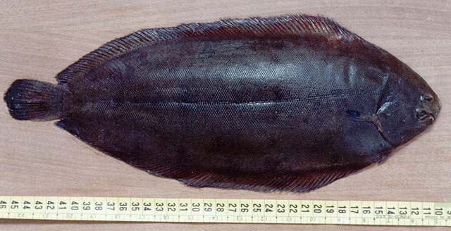

```{r setup, echo=FALSE, message=FALSE, warning=FALSE}
library(tidyverse)
library(cowplot)
library(readxl)
library(GGally)
library(ggrepel)
library(car)

```

## Notes

## Readings


- Tabachnick and Fidell [-@tabachnick_using_2013]: *Using Multivariate Statistics*
- Zuur et al. [-@zuur_analysing_2007]: *Analyzing Ecological Data*

## Hierarchy of GLMs

<center>

</center>

## *Generalized* linear models

$$\mbox{Response variable(s)} \sim \mbox{Predictor variable(s)} + \mbox{Error}$$

Distribution of the response variable(s) can be:

1. Normal (Gaussian)
1. Binomial (two states)
1. Poisson (counts)
1. Lots and lots of others

## General equation form of GLMs

$$Y = \beta_0 + \beta_1X_1 + \beta_2X_2 + \dots + \beta_nX_n$$

$Y$ follows some distribution (e.g., $Y \sim \mathcal{N}$ or $Y \sim \mbox{Binom}$)

- Most often normal.

$X_n$  are some combination of continuous and categorical predictors.

$\beta_n$ are the parameter estimates for the $X$.

## Logistic regression

Outcome variable is categorical:

- Heart disease
- Diabetes
- Cancer

Predictors can be a mix of categorical and continuous variables:

- sex, smoking status, family history of ...
- body mass, BMI, blood glucose level

## Logistic regression

What are the predictors of presence or absence?

- Morphology
- Character state
- Species
- Rain

## Challenge

How much variance is there in 0's and 1's?

## Odds

$$\mbox{Odds} = \frac{P_{event}}{1 - P_{event}}$$

Odds is the ratio of the probability of an event to the probability of no event.

$$\log O_i = \log \left(\frac{P_i}{1 - P_i} \right) = \mbox{logit}(P_i)$$

Logit function converts probabilities to a continuous value not bounded by 0 and 1.

## Probabilities, odds, and log odds

P  | 0.001 | 0.5 | 0.999
--:|--:|--:|--:|
1 - P    | 0.999 | 0.5 | 0.001
Odds     | 0.001 | 1   | 999
log(Odds) | -6.9  | 0   | 6.9

## Probabilities to log odds

```{r}
P <- seq(0.0001, 0.9999, length.out = 1000)
Odds <- P / (1 - P)
log_Odds <- log(Odds)
M <- data.frame(P, Odds, log_Odds)
```

## Probabilities to log odds

```{r echo=FALSE}
ggplot(M, aes(P, Odds)) + geom_line() +
  labs(x = "Probability", y = "Odds")
```

## Probabilities to log odds

```{r echo=FALSE}
ggplot(M, aes(P, log_Odds)) + geom_line() +
  labs(x = "Probability", y = "log Odds")
```

log-Odds ranges from never (-$\infty$) to always ($\infty$).

## Link functions

1. Gaussian: Identity
1. Binomial: Logit
1. Poisson: Log

## Logistic regression

$$\mbox{logit}(Y) = \beta_0 + \beta_1X_1 + \beta_2X_2 + \dots + \beta_nX_n$$

The logit "transformation" allows $\beta$s to be estimated iteratively.

Fitting in R:

- `glm()` uses the formula interface
- `family = ` determines the link function
    - "Gaussian" $\rightarrow$ identity
    - "binomial" $\rightarrow$ logit
    - "Poisson" $\rightarrow$ log

## Self-interacting additive predictors in GLM

????????

$$\log \frac{P}{1 - P} = \beta_0 + \beta_1 x$$

$$P = \frac{\exp(\beta_0 + \beta_1 x)}{1 + \exp(\beta_0 + \beta_1 x)}$$

$$\frac{dP}{dx} = \frac{\beta_1}{2(1 + \cosh(\beta_0 + \beta_1 x))}$$

The impact of a change in $x$ on $P$ depends on the value of $x$.

Differentiate with Wolfram alpha: http://bit.ly/1R4Hlxj

## Logistic regression

```{r}
set.seed(4)
rainfall <- c(runif(20, 100, 160),
              runif(20, 160, 210)) 
presence <- c(rbinom(20, 1, 0.15),
              rbinom(20, 1, 0.95))
LogReg <- data.frame(Rainfall = rainfall,
                     Presence = as.factor(presence))
head(LogReg)
```

## Fitting a logistic model

```{r}
fm <- glm(Presence ~ Rainfall,
          data = LogReg,
          family = "binomial")
```

*Note*: `Presence` is a factor with two levels

## Summarizing {.smaller}

```{r}
summary(fm)
```

## Summarizing with `logistic.display()`

```{r}
library(epiDisplay)
logistic.display(fm)
```

## Visualizing

```{r log_plot, eval=FALSE}
ggplot(LogReg, aes(x = Rainfall,
                   y = as.numeric(Presence) - 1)) + 
  geom_hline(yintercept = 0.5, linetype = "dotted", size = 0.5) +
  geom_smooth(method = "glm",
              method.args = list(family = "binomial"),
              se = FALSE, size = 2) + 
  geom_point(size = 3) +
  ylab("Probability of Presence") +
  xlab("Rainfall (cm/y)") +
  scale_y_continuous(breaks = seq(0, 1, by = 0.1))
```

## Visualizing

```{r echo=FALSE, ref.label="log_plot"}
```

## Presence of sole

<center>

</center>

## Presence of sole

Presence/absence of sole in the Tagus estuary of Portugal.

```{r}
M <- read_excel("../data/Sole.xlsx")
str(M)
```

## Presence of sole

```{r}
M <- M[,c("salinity", "Solea_solea")]
M$Solea_solea <- factor(M$Solea_solea)
```

## Presence of sole

```{r}
fm <- glm(Solea_solea ~ salinity, data = M, family = "binomial")
```

## Presence of sole {.smaller}

```{r echo=FALSE}
summary(fm)
```

## Presence of sole

```{r}
logistic.display(fm)
```

## Presence of sole

```{r echo=FALSE}
ggplot(M, aes(x = salinity,
              y = as.numeric(Solea_solea) - 1)) + 
  geom_hline(yintercept = 0.5, linetype = "dotted", size = 0.5) +
  geom_smooth(method = "glm",
              method.args = list(family = "binomial"),
              se = FALSE, size = 2) + 
  geom_point(size = 3) +
  ylab("Probability of Presence") +
  xlab("Salinity") +
  scale_y_continuous(breaks = seq(0, 1, by = 0.1))
```

## Drug testing

```{r}
M <- read_excel("../data/Drug_test.xlsx")
M$Treatment <- factor(M$Treatment)
str(M)
```

## Drug testing

```{r warning=FALSE}
ggscatmat(as.data.frame(M), 1:3, color = "Treatment")
```

## Drug testing

```{r}
fm <- glm(Treatment ~ Fever + BP + Pain, data = M,
          family = "binomial")
```

## Drug testing {.smaller}

```{r echo=FALSE}
summary(fm)
```

## Drug testing {.smaller}

```{r}
logistic.display(fm)
```

## Drug testing

```{r}
Anova(fm, type = "III")
```

## Drug testing

Predict new data for `Fever`, with 0 for `BP` and `Pain`:

```{r}
n <- 30
M_new <- data.frame(Fever = seq(36, 42, length.out = n),
                    BP = rep(0, n),
                    Pain = rep(0, n))
predicted <- predict(fm, M_new)
M_new$Treatment <- 1 / (1 + exp(-predicted))
```

$$\mbox{Inverse logit} = \frac{1}{1 + \exp (\mbox{-Predicted})}$$

## Drug testing

```{r echo=FALSE}
ggplot(M, aes(x = Fever,
              y = as.numeric(Treatment) - 1)) + 
  geom_hline(yintercept = 0.5, linetype = "dotted", size = 0.5) +
  geom_line(data = M_new, aes(Fever, Treatment), size = 2, color = "blue") +
  geom_point(size = 3) +
  ylab("Probability of Placebo") +
  xlab("Fever") +
  scale_y_continuous(breaks = seq(0, 1, by = 0.1)) + 
  ggtitle("BP = 0; Pain = 0")
```

## Drug testing

```{r echo=FALSE}
n <- 30
M_new <- data.frame(Fever = seq(36, 42, length.out = n),
                    BP = rep(mean(M$BP), n),
                    Pain = rep(mean(M$Pain), n))
predicted <- predict(fm, M_new)
M_new$Treatment <- 1 / (1 + exp(-predicted))

ggplot(M, aes(x = Fever,
              y = as.numeric(Treatment) - 1)) + 
  geom_hline(yintercept = 0.5, linetype = "dotted", size = 0.5) +
  geom_line(data = M_new, aes(Fever, Treatment), size = 2, color = "blue") +
  geom_point(size = 3) +
  ylab("Probability of Placebo") +
  xlab("Fever") +
  scale_y_continuous(breaks = seq(0, 1, by = 0.1)) + 
  ggtitle("BP = mean(BP); Pain = mean(Pain)")
```

Curve shifts left to right based on the values of `BP` and `Pain` 

## Tibetan skulls

```{r}
M <- read_excel("../data/Tibetan_Skulls.xlsx")
str(M)
M <- M %>% mutate(Origin = factor(Origin))
```

## Tibetan skulls

```{r echo=FALSE}
ggscatmat(as.data.frame(M), 1:5, color = "Origin") +
  theme(text = element_text(size = 9),
        axis.text = element_text(size = 6),
        axis.text.x = element_text(angle = -90, vjust = 0.5))
```

## Tibetan skulls

```{r}
fm <- glm(Origin ~ ., data = M, family = "binomial")
```

- Use `~ .` to include all other variables

## Tibetan skulls {.smaller}

```{r echo=FALSE}
summary(fm)
```

## Tibetan skulls {.smaller}

```{r}
logistic.display(fm)
```

## Tibetan skulls

```{r}
Anova(fm, type = "III")
```

## Logistic regression as a classifier

Logistic regression:

- Which variable(s) are good predictors of group membership

## Tibetan skulls

```{r}
M <- read_excel("../data/Tibetan_Skulls.xlsx")
M <- M %>% mutate(Origin = factor(Origin)) %>% as.data.frame()
skulls_lda <- lda(Origin ~ ., data = M)
```

- Convert `M` to a `data.frame()` to avoid problems later (`Incompatible methods ("Ops.factor", "Ops.data.frame") for "=="`).

## Tibetan skulls

```{r}
skulls_predict <- predict(skulls_lda, M[, 1:5])
(skulls_classify <- skulls_predict$class)
```

## Tibetan skulls

```{r}
mean(skulls_classify == M$Origin)
table(Original = M$Origin, Predicted = skulls_classify)
```

## Oreodonts

Skull measurements of oreodonts

<center>

</center>

## Oreodonts

```{r}
M <- read_excel("../data/Oreodont.xlsx")
str(M)
M$Sex <- factor(M$Sex)

# Convert to data.frame
M <- as.data.frame(M)
```

## Oreodonts

```{r}
M %>% group_by(Sex) %>% summarise_each("mean")
```

## Oreodonts

```{r echo=FALSE}
ggplot(M, aes(Length, Width, color = Sex)) +
  geom_point(size = 3)
```

## Oreodonts

```{r}
oreo_lda <- lda(Sex ~ ., data = M)
oreo_predict <- predict(oreo_lda, M[, 1:2])
(oreo_classify <- oreo_predict$class)
```

## Oreodonts

```{r}
mean(oreo_classify == M$Sex)
table(Original = M$Sex, Predicted = oreo_classify)
```

## Predict sex of new oreodonts

```{r}
new_oreo <- data.frame(Length = c(30, 25, 25),
                       Width = c(15, 20, 15))
predict(oreo_lda, new_oreo)
```

## Generalized linear multilevel models

Generalization of Gaussian multilevel models to all the kinds of predictors that generalized linear models can be used for

Large can of worms:

- http://glmm.wikidot.com/faq


## Quiz 08-4

No more Lectures

## References {.references}

