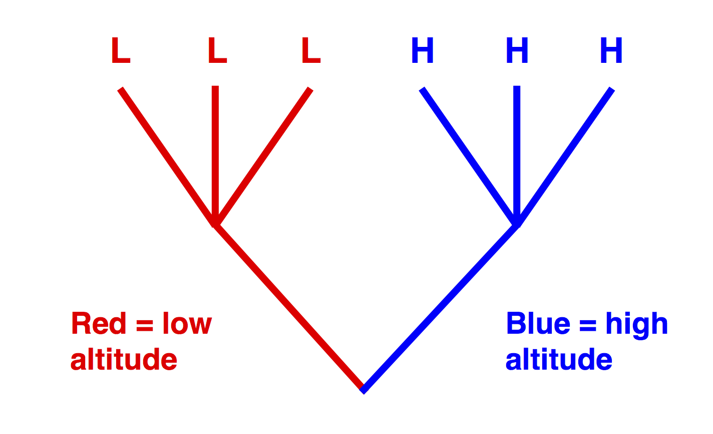
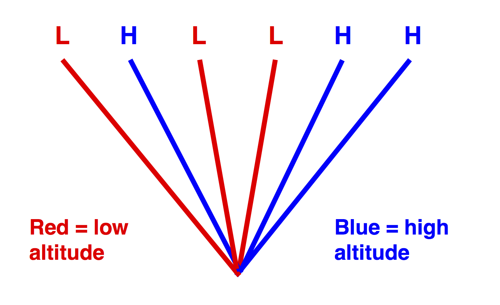
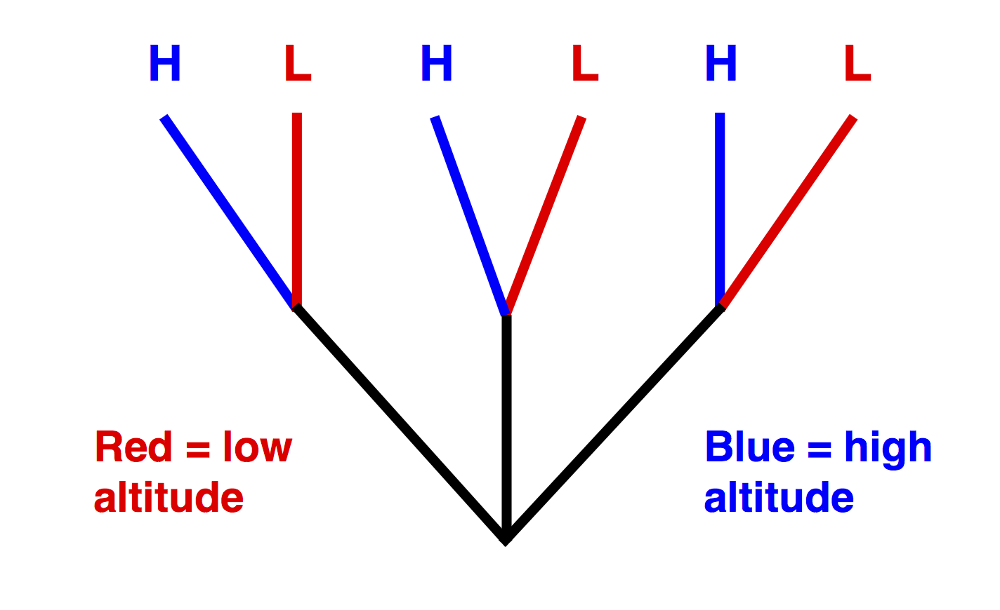

```{r setup, echo=FALSE, message=FALSE, warning=FALSE}
library(tidyverse)
library(cowplot)
library(readxl)
library(wesanderson)
```

## Readings


## IID is often violated

Recall IID = Independent and Identically Distributed
   
- Assumption of most statistical tests
- In biological situations, independence assumption is often violated

<center>

</center>

## When is independence assumption violated?
  
  - When there is a hierarchical structure to the data
      - e.g. several samples at each site 
  - Shared ancestry
      - phylogenetic relatedness (between populations/species)
      - genetic relatedness (between individuals within populations/species)
  - Sampling over time
  - ...
  
## Why is non-independence a problem?

Does higher altitude drive the evolution of higher levels of hemoglobin?

```{r echo=FALSE, fig.width=7, fig.height=4}
ex.dat <- data.frame('Altitude'=c(0,1400,2500,3500,4500,6000),
                     'Hemoglobin'=c(9,15,11,21,16,20),
                     'Clade' = rep(c('A','B'),each=3)) 
ggplot(ex.dat, aes(x=Altitude, y=Hemoglobin)) +
  geom_point(size=6)

```

## Why is non-independence a problem?

Does higher altitude drive the evolution of higher levels of hemoglobin?

```{r echo=FALSE, fig.width=7, fig.height=4}
ggplot(ex.dat, aes(x=Altitude, y=Hemoglobin, color=Clade)) +
  geom_point(size=6)

```

## Why is non-independence a problem?

  - Pseudoreplication: artificially inflated sample size lead to unfounded confidence

<center>

</center>

## Conventional statistics assume

<center>

</center>

## Best case for this example

<center>

</center>

## Quiz 11-1

Lecture 11-2

## References
