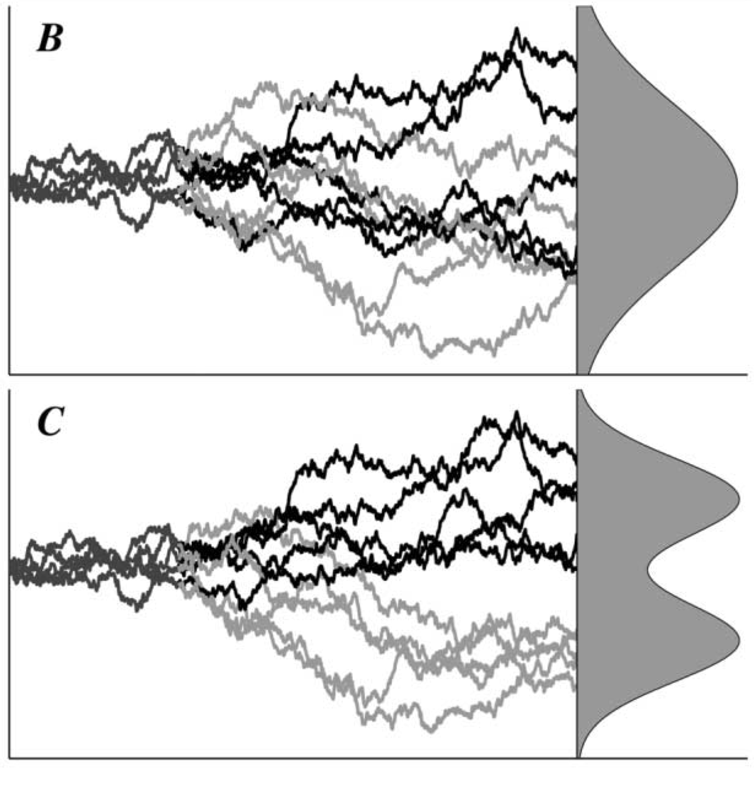
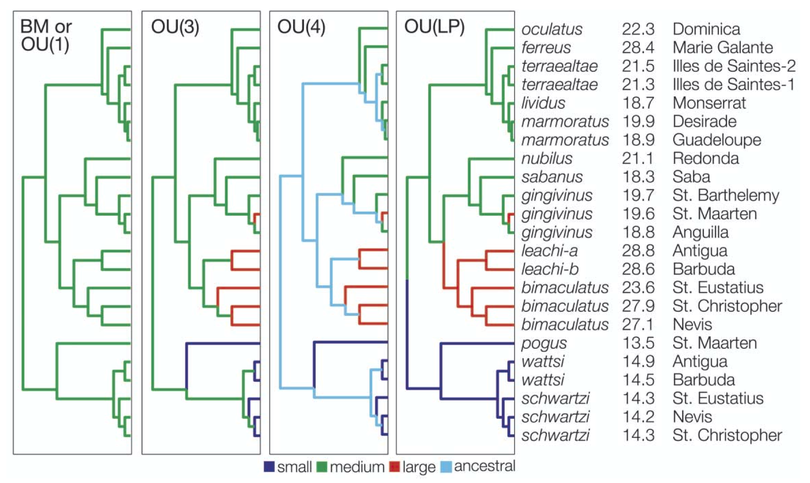
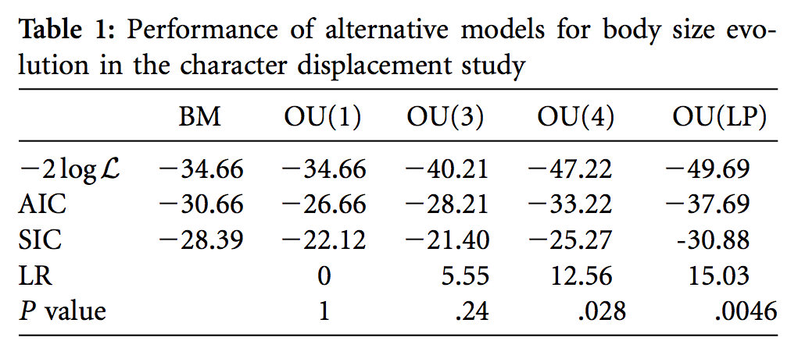
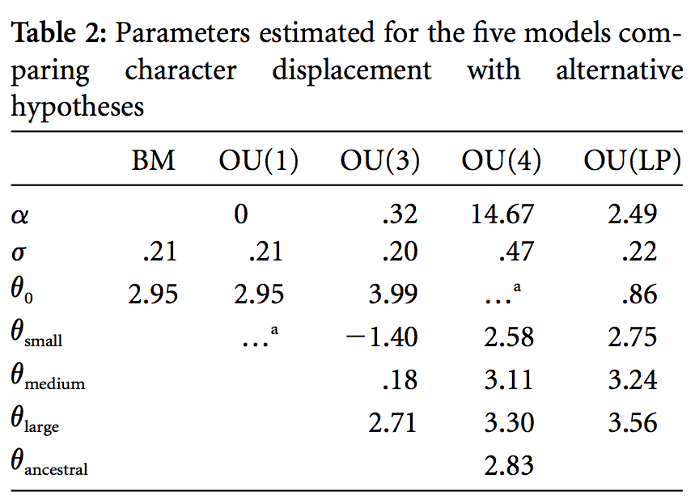

```{r setup, echo=FALSE, message=FALSE, warning=FALSE}
knitr::opts_chunk$set(cache = TRUE)
library(tidyverse)
library(cowplot)
library(readxl)
library(wesanderson)
library(ape)
library(phytools)
# source("https://bioconductor.org/biocLite.R")
# biocLite("ggtree")
# install_github("GuangchuangYu/ggtree")
# install_github("GuangchuangYu/treeio")
library(ggtree)
library(foreach)
library(reshape2)
library(geiger)
library(latex2exp)
```

## Trees and tree thinking

- As soon as you have comparative data, you must consider the relationships among your taxa
    - No longer an option (30+ years of methods)
- Not concerned in this class with making the tree(s)

You have a tree and data
  - What do I do now?

## Where does your tree come from?

- Published trees
    - As is
    - Pruned down from published trees
- Constructed from multiple trees
- Including tree uncertainty
    - Compare effect of different taxon placements

<center>
*Trees are hypotheses of relationships. You have hypotheses resting on hypotheses.*
</center>

## Polytomies

**Hard**:

- Rapid speciation

**Soft**:

- Uncertainty of relationships
- Adjust the degrees of freedom for tests [@Diaz-Uriarte1996-fe; @Diaz-Uriarte1998-kk]
- Convert polytomies into very short branches for procedures that can't handle soft polytomies

## Polytomies

```{r echo=FALSE}
poly_tree <- read.tree(text = "(((A,B,C),(D,E)),F);")
ggtree(poly_tree) + geom_tiplab(size = 3)
```

## Is body size associated with home range area in mammals?

Data from Garland et al. [-@Garland1992-bf]

- Body mass (km)
- Home range area (km^2^)
- "49lbr" data

## Home range vs. body mass

```{r echo=FALSE}
tree <- read.nexus("../data/49LBR70.PDI.nex")
lbr <- read_excel("../data/49LBR.xlsx")
lbr$Clade <- relevel(as.factor(lbr$Clade), ref = "Ungulates")

ggplot(lbr, aes(log_Mass, log_Home_Range)) +
  geom_point(size = 3) +
  labs(x = "log Body Mass", y = "log Home Range")
```

## Home range vs. body mass

```{r echo=FALSE}
ggplot(lbr, aes(log_Mass, log_Home_Range, color = Clade)) +
  geom_point(size = 3) +
  labs(x = "log Body Mass", y = "log Home Range") +
  theme(legend.position = c(0.85, 0.2)) +
  scale_color_manual(values = wes_palette("Moonrise2"))
```

## Home range vs. body mass

```{r echo=FALSE}
ggtree(tree, ladderize = FALSE) +
  geom_tiplab(size = 3) +
  geom_treescale()
```

## Home range vs. body mass

```{r echo=FALSE}
tree2 <- groupClade(tree, node = 51)
ggtree(tree2, aes(color = group), ladderize = FALSE) +
  geom_tiplab(size = 3) +
  geom_treescale() +
  scale_color_manual(values = wes_palette("Moonrise2"))
```

## Why phylogenetic comparative methods?

1. Meet the assumptions of standard statistical tests
    - Any test you can do using "standard" methods has a phylogenetically informed counterpart.
    - What is your evolutionary model?
2. Ask and answer nuanced evolutionary questions
    - Trait evolution (continuous or categorical)
    - Trait co-evolution
    - Rates of evolution (identify nodes when rates shift significantly)
    - What is your evolutionary model?

## Branch lengths $\approx$ evolutionary model

"Real" branch lengths:

- Divergence dates (e.g., fossil calibrated)
- Genetic or character distance (relative)

Arbitrary branch lengths:

- All = 1
- Pagel's ultrametric transformation (1992): total height = deepest nesting

Either can be transformed.

## Divergence dated

```{r echo=FALSE}
ggtree(tree, ladderize = FALSE) +
  geom_tiplab(size = 3) +
  geom_treescale()
```

## All = 1

```{r echo=FALSE}
tree_1 <- tree
tree_1$edge.length <- rep(1, times = length(tree_1$edge.length))
ggtree(tree_1, ladderize = FALSE) +
  geom_tiplab(size = 3) +
  geom_treescale()
```

## Square-root divergence time

```{r echo=FALSE}
tree_sqrt <- tree
tree_sqrt$edge.length <- sqrt(tree_sqrt$edge.length)
ggtree(tree_sqrt, ladderize = FALSE) +
  geom_tiplab(size = 3) +
  geom_treescale()
```

## Models of evolution

- Brownian motion
- Ornstein-Uhlenbeck (OU)
- Variable rates (ACDC)
- Pagel's lambda

**These models are all accomplished via branch length transformations.**

## Brownian motion

- The default, null underlying model for evolution
- Simplest, most parsimonious model of drift
- No selection
- At each step, a trait value is randomly altered based on a normal distribution (mean usually 0) with some variance.

## Brownian motion

Simulate 100 Brownian motion random walks with a length of 100 steps.

```{r}
set.seed(3)
nsim <- 100
t <- 0:100  # time
s2 <- 0.01

X <- foreach(i = 1:nsim, .combine = rbind) %do%
  c(0, cumsum(rnorm(n = length(t) - 1, sd = sqrt(s2))))
```

## Brownian motion

```{r echo=FALSE}
lims <- range(X)
M_one <- data.frame(t = 1:ncol(X),
                    x = as.numeric(X[1, ]))
ggplot(M_one, aes(t, x)) + geom_line() +
  ylim(lims) +
  labs(x = "Time (generations)", y = "Phenotype")
```

## Brownian motion

```{r echo=FALSE}
M <- as.data.frame(t(X))
M$t <- 1:ncol(X)
M_long <- melt(M, id = "t")
ggplot() +
  geom_line(data = M_long, aes(t, value, group = variable),
            alpha = 0.25) +
  geom_line(data = M_one, aes(t, x), color = "red", size = 2) +
  ylim(lims) +
  labs(x = "Time (generations)", y = "Phenotype")
```

## Brownian motion

```{r long_BM_sim, echo=FALSE, cache=TRUE}
set.seed(3)
nsim <- 500
t <- 0:1000  # time
sig2 <- 0.01

X <- foreach(i = 1:nsim, .combine = rbind) %do%
  c(0, cumsum(rnorm(n = length(t) - 1, sd = sqrt(sig2))))

lims <- range(X)
M_one <- data.frame(t = 1:ncol(X),
                    x = as.numeric(X[1, ]))

M <- as.data.frame(t(X))
M$t <- 1:ncol(X)
M_long <- melt(M, id = "t")
ggplot() +
  geom_line(data = M_long, aes(t, value, group = variable),
            alpha = 0.25) +
  geom_line(data = M_one, aes(t, x), color = "red", size = 2) +
  ylim(lims) +
  labs(x = "Time (generations)", y = "Phenotype")
```

## Brownian motion

```{r echo=FALSE}
x <- as.numeric(t(M[nrow(M), 1:(ncol(M) - 1)]))
ggplot(data.frame(x), aes(x)) +
  geom_histogram(bins = 30) +
  labs(x = "Phenotype", y = "Count")
```

## Ornstein-Uhlenbeck model

- Based on Ornstein & Uhlenbeck [-@Uhlenbeck1930-xx]
- Brownian motion doesn't allow for adaptive evolution (drift only)
- Simplest model for an evolutionary process with selection (deterministic + stochastic)

> The OU model describes the motion of a species in the phenotypic space whereby the species moves randomly within the space, but is influenced by a central tendency such that large deviations from the central optimum receive a stronger force back toward the optimum [@Blomberg2003-jk]

## Ornstein-Uhlenbeck model (OU)

$$dX(t) = \alpha[\theta - X(t)]dt + \sigma dB(t)$$

- Change in trait X at time *t* is a function of selection $\alpha[\theta - X(t)]dt$ and drift $\sigma dB(t)$
    - $\alpha$ = strength of selection
    - $\theta$ = optimum
    - $\sigma$ = magnitude of drift
- $\alpha$ and one or more local optima ($\theta_1$, $\theta_2$, etc.) can be estimates
- Models compared with likelihood ratio tests, AIC, etc.

## Ornstein-Uhlenbeck model (OU)

Key readings:

- Hansen and Martins [-@Hansen1996-ad]
- Blomberg et al. [-@Blomberg2003-jk]
- Butler and King [-@Butler2004-ey]

## OU evolution along a tree

```{r}
library(phytools)
set.seed(331)
tree <- pbtree(n = 15, scale = 10)
```

## OU evolution along a tree

```{r echo=FALSE}
ggtree(tree, ladderize = FALSE) +
  geom_tiplab(size = 3)
```

## OU evolution along a tree

$$dX(t) = \alpha[\theta - X(t)]dt + \sigma dB(t)$$

```{r}
x <- fastBM(tree,
            a = 0,           # Ancestral state at the root node
            theta = 3,       # Optimum
            alpha = 0.2,     # Strength of selection
            sig2 = 0.1,      # Variance of the BM process
            internal = TRUE) # Return states for internal nodes
```

## OU evolution along a tree

```{r}
phenogram(tree, x, spread.labels = TRUE, spread.cost = c(1, 0.01),
          main = "scale = 10, alpha = 0.2, sig2 = 0.1")
```

## OU evolution along a tree

```{r echo=FALSE}
set.seed(331)
tree <- pbtree(n = 15, scale = 100)
x <- fastBM(tree,
            a = 0,           # Ancestral state at the root node
            theta = 3,       # Character state optimum
            alpha = 0.2,     # Strength of selection
            sig2 = 0.1,      # Variance of the BM process
            internal = TRUE) # Return states for internal nodes
phenogram(tree, x, spread.labels = TRUE, spread.cost = c(1, 0.01),
          main = "scale = 100, alpha = 0.2, sig2 = 0.1")
```

## OU evolution along a tree

```{r echo=FALSE}
set.seed(331)
tree <- pbtree(n = 15, scale = 10)
x <- fastBM(tree,
            a = 0,           # Ancestral state at the root node
            theta = 3,       # Character state optimum
            alpha = 0.5,     # Strength of selection
            sig2 = 0.1,      # Variance of the BM process
            internal = TRUE) # Return states for internal nodes
phenogram(tree, x, spread.labels = TRUE, spread.cost = c(1, 0.01),
          main = "scale = 10, alpha = 0.5, sig2 = 0.1")
```

## OU evolution along a tree

```{r echo=FALSE}
set.seed(331)
tree <- pbtree(n = 15, scale = 10)
x <- fastBM(tree,
            a = 0,           # Ancestral state at the root node
            theta = 3,       # Character state optimum
            alpha = 0.2,     # Strength of selection
            sig2 = 0.5,      # Variance of the BM process
            internal = TRUE) # Return states for internal nodes
phenogram(tree, x, spread.labels = TRUE, spread.cost = c(1, 0.01),
          main = "scale = 10, alpha = 0.2, sig2 = 0.5")
```

## Estimating an OU model

Rather than simulating data, estimate the values for $\alpha$ and $\theta$.

1. Given a tree and data (body mass in Caribbean anoles)
2. What model of evolution best fits the data?
    - Brownian motion
    - OU model with a single, clade-wide optimum
    - OU model with three body size optima (S/M/L)
    - OU model with four optima (including an ancestral size)
    - OU model based on multiple colonization events

## Estimating an OU model

Evolution toward two local optima:

<center>

</center>

## Estimating an OU model

<center>

</center>

## Estimating an OU model

<center>

</center>

## Estimating an OU model

<center>

</center>

$\theta_{small} = `r round(exp(-1.4), 2)`$ mm head length.

## ACDC

- Evolution that either increases or decreases in rate over time.
    - Adaptive radiations followed by phenotypic stasis
    - Proposed by Blomberg et al. [-@Blomberg2003-jk]
- "Early burst" model of Harmon et al. [-@Harmon2010-gl]
- Didn't really ever catch on as much as OU.

## Models of evolution $\approx$ branch length transformations

Pagel's $\lambda$: how well does the tree fit the predicted covariance among the trait values

- $1$ = Brownian motion
- $>1$ = nodes pulled toward the tips (stronger covariance than expected by BM)
- $<1$ = nodes pulled toward the root (weaker covariance than expected by BM; more common)

$$\lim_{d\to0} = \mbox{"Star phylogeny"}$$

## Pagel's $\lambda$ branch scaling

```{r echo=FALSE}
set.seed(10)
tree <- pbtree(n = 30, b = 2)
ggtree(tree, ladderize = FALSE) +
  geom_tiplab(size = 3) +
  ggtitle(TeX("Original Branch Lengths ($\\lambda = 1$)"))
```

## Pagel's $\lambda$ branch scaling

```{r echo=FALSE}
ggtree(rescale(tree, "lambda", 0.5), ladderize = FALSE) +
  geom_tiplab(size = 3) +
  ggtitle(TeX("$\\lambda = 0.5$"))
```

## Pagel's $\lambda$ branch scaling

```{r echo=FALSE}
ggtree(rescale(tree, "lambda", 0.1), ladderize = FALSE) +
  geom_tiplab(size = 3) +
  ggtitle(TeX("$\\lambda = 0.1$"))
```

## Pagel's $\lambda$ branch scaling

```{r echo=FALSE}
ggtree(rescale(tree, "lambda", 0.001), ladderize = FALSE) +
  geom_tiplab(size = 3) +
  ggtitle(TeX("$\\lambda = 0.001$"))
```

## Non-R resources

Mesquite (http://mesquiteproject.org/)

- Enter, store, and manipulate trees
- Branch length alternations
- Models of character evolution (discrete, continuous)
- PDAP module (http://mesquiteproject.org/pdap_mesquite/)
    - Lots of functions for working with comparative data

## R Resources

CRAN Task View:  https://cran.r-project.org/web/views/Phylogenetics.html

Common packages:

- ape
- geiger
- phytools
- picante
- caper

## Quiz 11-2

Lecture 11-3

## References
