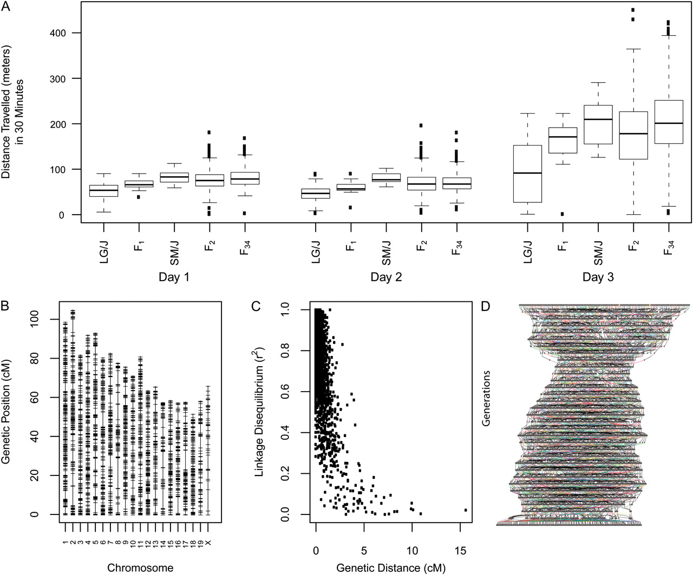

```{r setup, echo=FALSE, message=FALSE, warning=FALSE}
library(tidyverse)
library(cowplot)
library(readxl)
```


## Resources

-Animal model paper

- Yang J, Zaitlen NA, Goddard ME, Visscher PM, Price AL [-@Yang2014-cz] Advantages and pitfalls in the application of mixed-model association methods. *Nat Genet* 46:100-106.

- Lynch & Walsh
- Falconer & Mackay
- Roff

https://www.r-bloggers.com/fitting-linear-mixed-models-for-qtl-mapping/

## Kinship (non-independence) as a tool

When modeled correctly, non-independence between samples can be very useful

  - Forms the basis for how we estimate heritabilities, genetic correlations, etc.
  - Very similar in concept to repeatability
  - Estimate the variance within families/lines (groups) versus between families/lines
  - Modern methods can consider complex pedigrees or relatedness estimated directly from genomic data

## Heritability and genetic correlation

<center>

</center>


## Load pedigree

```{r, message=FALSE}
library(MCMCglmm)
library(kinship2)

data(BTped)

Nped <- BTped[which(apply(BTped, 1, function(x) {
  any(x == "R187920" | x == "R187921")})), ]
Nped
```

## Plot part of pedigree

```{r warning=FALSE}
ped <- pedigree(id = Nped$animal,
                dadid = Nped$sire,
                momid = Nped$dam,
                sex = c(2, 1, rep(3, nrow(Nped) - 2)))
plot(ped)
```

## Genetic distance

```{r}
str(BTped)

Aped <- 2 * kinship2::kinship(Nped[, 1], Nped[, 2], Nped[, 3])
Aped[1:6,1:6]
```

## Data

```{r}
data(BTdata)
head(BTdata)
```

## Heritability of tarsus length

```{r, eval = FALSE}
prior <- list(R = list(V = 0.002, n = 2),
              G = list(G1 = list(V = 0.002, n = 2)))

fm1 <- MCMCglmm(
  fixed = tarsus ~ 1,
  random = ~ animal,
  prior = prior,
  family = c("gaussian"),
  nitt = 60000, burnin = 10000, thin = 25,
  data = BTdata, pedigree = BTped,
  verbose = FALSE)
save(fm1, file = "../data/BT_herit.Rda")
```

```{r echo=FALSE}
load("../data/BT_herit.Rda")
```

## Fixed effects

```{r}
plot(fm1$Sol)
```

## Random effects

```{r}
plot(fm1$VCV)
```

## Heritability

$$h^2 = \frac{V_a}{V_a + V_r}$$

```{r}
herit <- fm1$VCV[, "animal"] / (fm1$VCV[, "animal"] + fm1$VCV[, "units"])
plot(herit)
```

## Heritability

```{r}
median(herit)
HPDinterval(herit)
```

## Genetic correlation

```{r eval=FALSE}
prior <- list(R = list(V = diag(2) * 1.001, n = 2),
              G = list(G1 = list(V = diag(2)  * 1.001, n = 2)))

fm2 <- MCMCglmm(
  fixed = cbind(back, tarsus) ~ trait,
  random = ~ us(trait):animal,
  rcov = ~ us(trait):units,
  prior = prior,
  family = c("gaussian", "gaussian"),
  nitt = 60000, burnin = 10000, thin = 25,
  data = BTdata, pedigree = BTped,
  verbose = FALSE)
save(fm2, file = "../data/BT_genetic_correlation.Rda")
```

```{r echo=FALSE}
load("../data/BT_genetic_correlation.Rda")
```

## Genetic correlation

```{r}
Genet_Corr <- fm2$VCV[ , "traittarsus:traitback.animal"] /
  sqrt(fm2$VCV[ , "traittarsus:traittarsus.animal"] *
         fm2$VCV[ , "traitback:traitback.animal"])
plot(Genet_Corr)
```

## Genetic correlation

```{r}
median(Genet_Corr)
HPDinterval(Genet_Corr)
```

## Kinship and GWAS

When individuals are related in different ways, correcting for kinship is critical to avoid spurious associations. This is necessary even when not including close relatives (e.g. siblings, cousins, etc.)

Typical data:

  - hundreds of thousands to millions of SNPs
  - phenotypes
  - hundreds to thousands of individuals
  - That's A LOT of tests! (speed matters)

## Kinship and GWAS

The typical model is a Linear Mixed Model (LMM) with fixed and random effects.

$$Y = W\beta + G\gamma + g + e$$
  
Y is the phenotype

Fixed effects:

  - W is a covariate (or more than one) with $\beta$ as the coefficient(s)
  - G is the genotype with $\gamma$ as the coefficient

## Kinship and GWAS

The typical model is a Linear Mixed Model (LMM) with fixed and random effects.

$$Y = W\beta + G\gamma + g + e$$
  
Random effects:

  - g is a vector of polygenic effects scaled according to relatedness between individuals
  - e is the error term

## Kinship Matrix

Kinship matrix can be 
  
  - estimated from a pedigree
  - estimated from the genomic data

## Mice on Meth

<center>

</center>

## Mice on Meth

<center>

</center>


    
## Quiz 11-3

No more lectures

## References
