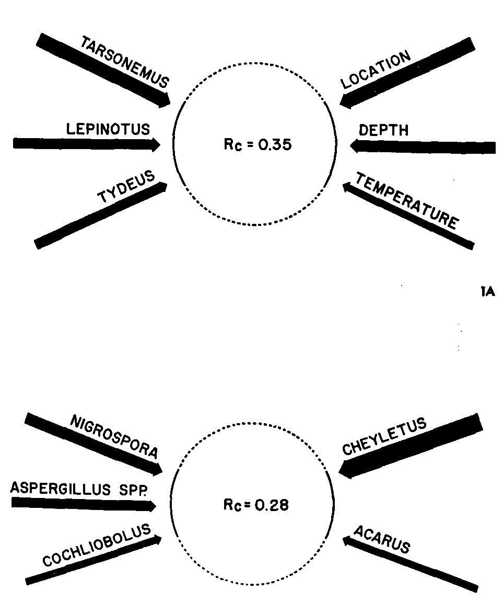
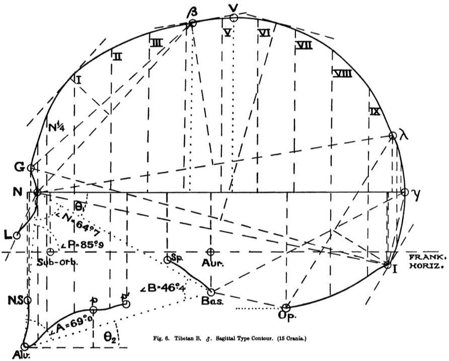

```{r setup, echo=FALSE, message=FALSE, warning=FALSE}
library(tidyverse)
library(readxl)
library(cowplot)
library(CCA)
library(candisc)
library(GGally)
library(car)
```

## Resources

- Borcard et al. [-@Borcard2011-ks] *Numerical Ecology with R*. Springer.
- Everitt and Hothorn [-@Everitt2011-eu] *An Introduction to Applied Multivariate Analysis with R*. Springer.
- Tabachnick and Fidell [-@Tabachnick2013-yo]: *Using Multivariate Statistics*. Pearson.

## Approaches to continuous data

*Correlation*:

- 2 interchangeable variables

*PCA*:

- 0 outcome variables (`~ .`)
- *q* possibly correlated variables

*Multiple regression*:

- 1 continuous outcome variable
- *q* predictors

## Canonical correlation

Correlations of *linear combinations* of a set of multiple continuous variables with a separate set of multiple continuous variables.

- Multiple variables ~ Multiple variables
- Weather variables vs. Growth variables
- Ecology variables vs. Urbanization variables
- Diversity variables vs. Landscape variables

## Canonical correlation

*Pairs* of canonical variates:

- Like a PCA on both sets of variables, but constrained to maximize the correlation between the *i*th pair of composite variables (canonical correlates)
- However, *not just the correlation of PCs*.

## Wheat

> "Two identical 13.6-ton (500 bu.) parcels of Manitoba Northern wheat, variety Selkirk, were stored 183 cm deep in 2 similar and adjoining 305 cm X 333 cm wooden bins in a granary in Winnipeg during 1959-67. Two hundred-gram samples were collected monthly from fixed sampling sites in the bins." Sinha et al. [-@Sinha1969-mp]

Measure biotic (insects, fungi, mites) and abiotic (location, depth, temperature) factors.

- How do these correlate?

## Wheat

<center>

</center>

## Generating multivariate data

Generate multivariate normal data with a specified correlation coefficient:

```{r}
MVnorm <- function(n, rho, mu, lab, sigma = 1) {
  Sigma <- matrix(c(sigma ^ 2, rho * sigma ^ 2,
                    rho * sigma ^ 2, sigma ^ 2), 2)
  x <- MASS::mvrnorm(n, mu, Sigma, empirical = TRUE)
  colnames(x) <- paste0(lab, 1:2)
  return(x)
}
```

```{r}
set.seed(10)
X <- MVnorm(n = 30, rho = 0.5, mu = c(0, 0), lab = "X")
Y <- MVnorm(n = 30, rho = 0.7, mu = c(0, 0), lab = "Y")
```

## Generating multivariate data

```{r}
head(X)
head(Y)
```

## Canonical correlation in R

`cancor()`

- Built-in R function
- Rudimentary but functional

`candisc`

- Overrides `cancor()` with its own version
- Useful plotting functions

`CCA::cc()`

- `CCA` package extension of `cancor()`
- Plotting functions
- Handles missing data

## Canonical correlation {.smaller}

```{r}
library(candisc)
z <- cancor(X, Y)
z
```

## Canonical correlates

```{r}
z$cancor
```

Canonical correlates:

1. Xcan1 vs. Ycan1: 0.35
2. Xcan2 vs. Ycan2: 0.04

## Canonical coefficients

```{r}
z$coef
```

Interpret as you would multiple regression:

- 1 unit increase in `X1` leads to a -0.79 unit increase in CCx1 when all other variables are constant

## Canonical loadings {.smaller}

```{r}
z$structure
```

## CCA is adirectional

Are the coefficients equal up to some small tolerance value?

```{r}
all.equal(cancor(X, Y)$cancor, cancor(Y, X)$cancor)
```

- the multivariate equivalent of `cor(x, y) == cor(y, x)`.

## Visualizing

```{r}
plot(z, which = 1, smooth = TRUE)
```

## Visualizing

```{r}
plot(z, which = 2, smooth = TRUE)
```

## Head measurements

Head length and breadth from 25 pairs of sons:

```{r}
M <- read_excel("../data/headsize.xlsx")
str(M)
```

## Head measurements

```{r echo=FALSE}
p1 <- ggplot(M, aes(head1, breadth1)) + geom_point()
p2 <- ggplot(M, aes(head2, breadth2)) + geom_point()
plot_grid(p1, p2, ncol = 2)
```

## Head measurements

```{r}
ggscatmat(M)
```

## Head measurements

Split into two matrices and convert to *Z*-scores:

```{r}
M1 <- M %>% select(head1, breadth1) %>% as.matrix() %>% scale()
M2 <- M %>% select(head2, breadth2) %>% as.matrix() %>% scale()
```

Canonical correlation

```{r}
z <- cancor(M1, M2, set.names = c("First Born", "Second Born"))
z$cancor
```

## Head measurements

```{r echo=FALSE}
p1 <- ggplot(as.data.frame(M1), aes(head1, breadth1)) + geom_point()
p2 <- ggplot(as.data.frame(M2), aes(head2, breadth2)) + geom_point()
plot_grid(p1, p2, ncol = 2)
```

## Head measurements

```{r}
plot(z, which = 1, smooth = TRUE)
```

## Head measurements

```{r}
plot(z, which = 2, smooth = TRUE)
```

## Head measurements

Canonical coefficients

```{r}
z$coef
```

## Head measurements {.smaller}

Standardized canonical loadings

```{r}
z$structure
```

## Multivariate (Gaussian) linear models

Directional:

- `outcome variables ~ predictor variables`

1. "MLM": *p* Continuous ~ *q* Continuous
2. MANOVA and Hotelling's *T*^2^: *p* Continuous ~ *q* Categorical
3. MANCOVA: *p* Continuous ~ *q* Categorical + *r* Continuous
4. (Multiple) correspondence analysis: *p* Categorical ~ *q* Categorical

MANOVA creates a composite variable from the set of outcome variables and asks whether the groups differ.

## General approach

1. Think about the question you want to answer
2. Group the outcome variables into a single matrix (`cbind()`)
3. Fit a linear model with `lm()`, predicting the outcome matrix by some predictors using formula notation
4. Analyze with `Anova()` and visualize with `plot()` and `heplot()` [@Friendly2006-zz]

## Head measurements

```{r}
(fm <- lm(cbind(head1, breadth1) ~ head2 + breadth2, data = M))
```

## Head measurements

```{r}
coef(lm(head1 ~ head2 + breadth2, data = M))
coef(lm(breadth1 ~ head2 + breadth2, data = M))
```

## Head measurements

```{r}
Anova(fm, type = "III")
```

Pillai–Bartlett statistic is the most robust of the various statistics (Wilk's $\Lambda$, Hotelling's trace) that are most often reported.

## Head measurements

```{r}
heplot(fm)
```

## Drug testing

```{r}
M <- read_excel("../data/Drug_test.xlsx")
M$Treatment <- factor(M$Treatment)
str(M)
```

## Drug testing

```{r warning=FALSE}
ggscatmat(M, 1:3, color = "Treatment")
```

## Drug testing

```{r}
fm <- lm(cbind(Fever, BP, Pain) ~ Treatment, data = M)
fm
```

## Drug testing

```{r}
Anova(fm, type = "III")
```

## Drug testing

```{r}
heplot(fm, type = "III")
```

## Drug testing

```{r}
pairs(fm, type = "III")
```

## Tibetan skulls

Morant [-@Morant1923-co] published data on 32 skulls from Tibet:

```{r}
M <- read_excel("../data/Tibetan_Skulls.xlsx")
str(M)
M <- M %>% mutate(Origin = factor(Origin))
```

## Tibetan skulls

<center>

</center>

## Tibetan skulls

```{r echo=FALSE}
ggscatmat(M, 1:5, color = "Origin") +
  theme(text = element_text(size = 9),
        axis.text = element_text(size = 6),
        axis.text.x = element_text(angle = -90, vjust = 0.5))
```

## Tibetan skulls

```{r}
fm <- lm(cbind(Skull_Length, Skull_Width,
               Skull_Height, Face_Height,
               Face_Breadth) ~ Origin, data = M)
Anova(fm, type = "III")
```

## Tibetan skulls

```{r}
pairs(fm, type = "III")
```

## Quiz 13-2

Lecture 13-3

## References
