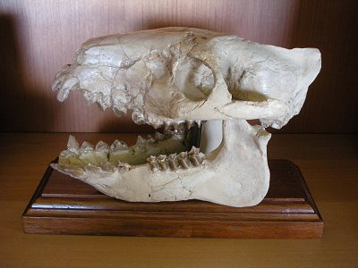

```{r setup, echo=FALSE, message=FALSE, warning=FALSE}
library(tidyverse)
library(readxl)
library(cowplot)
library(GGally)
library(epiDisplay)
library(car)
```

## Tibetan skulls

```{r}
M <- read_excel("../data/Tibetan_Skulls.xlsx")
str(M)
M <- M %>% mutate(Origin = factor(Origin))
```

## Tibetan skulls

```{r echo=FALSE}
ggscatmat(as.data.frame(M), 1:5, color = "Origin") +
  theme(text = element_text(size = 9),
        axis.text = element_text(size = 6),
        axis.text.x = element_text(angle = -90, vjust = 0.5))
```

## Tibetan skulls

```{r}
fm <- glm(Origin ~ ., data = M, family = "binomial")
```

- Use `~ .` to include all other variables

## Tibetan skulls {.smaller}

```{r echo=FALSE}
summary(fm)
```

## Tibetan skulls

```{r}
Anova(fm, type = "III")
```

## Tibetan skulls {.smaller}

```{r}
logistic.display(fm)
```

## Logistic regression to discriminant function analysis

Logistic regression:

- Which variable(s) are good predictors of group membership

Discriminant function analysis:

- Predict which categories sets of variables are good at predicting
- Groups are known *a priori*
- Uses linear combinations of variables
- Like the reverse of MANOVA
- **Predict new observations**

## Iris data

```{r}
glimpse(iris)
```

## Iris data

Anderson, E. 1935. The irises of the Gaspe Peninsula. *Bulletin of the American Iris Society* 59: 2–5.

```{r echo=FALSE}
ggplot(iris, aes(x = Petal.Length, y = Petal.Width, color = Species)) + 
  geom_point()
```

## Iris data

```{r echo=FALSE}
ggscatmat(iris, 1:4, color = "Species") +
  theme(text = element_text(size = 9),
        axis.text = element_text(size = 6),
        axis.text.x = element_text(angle = -90, vjust = 0.5))
```

## DFA in R

Linear discriminant analysis:

- `lda()` with `Group ~ Predictors`

```{r}
iris.lda <- lda(Species ~ . ,  data = iris)
```

## Posterior prediction

```{r}
iris.predict <- predict(iris.lda, iris[, 1:4])
iris.predict$posterior
```

## Classification

```{r}
(iris.classify <- iris.predict$class)
```

## Percent correct

Mean value of the correct classifications

```{r}
mean(iris.classify == iris$Species)
```

## Confusion matrix

```{r}
table(Original = iris$Species, Predicted = iris.classify)
```

## Predicting a new observation

```{r}
new_iris <- data.frame(Sepal.Length = c(6.11),
                       Sepal.Width = c(3.55),
                       Petal.Length = c(4.44),
                       Petal.Width = c(2.5))
```

## Predicting a new observation

```{r echo=FALSE, fig.height = 2.5}
ggplot(iris, aes(x = Petal.Length, y = Petal.Width, color = Species)) + 
  geom_point() +
  geom_point(data = new_iris, color = "red", size = 3)
```

```{r}
predict(iris.lda, new_iris)
```

## Predicting a new observation

```{r echo=FALSE, fig.height = 2.5}
new_iris <- data.frame(Sepal.Length = c(6.11),
                       Sepal.Width = c(3.55),
                       Petal.Length = c(5.05),
                       Petal.Width = c(1.66))
ggplot(iris, aes(x = Petal.Length, y = Petal.Width, color = Species)) + 
  geom_point() +
  geom_point(data = new_iris, color = "red", size = 3)
```

```{r}
predict(iris.lda, new_iris)
```

## Tibetan skulls

```{r}
M <- read_excel("../data/Tibetan_Skulls.xlsx") %>% 
  mutate(Origin = factor(Origin)) %>%
  as.data.frame()
str(M)

skulls_lda <- lda(Origin ~ ., data = M)
```

## Tibetan skulls

```{r}
skulls_predict <- predict(skulls_lda, M[, 1:5])
(skulls_classify <- skulls_predict$class)
```

## Tibetan skulls

```{r}
mean(skulls_classify == M$Origin)
table(Original = M$Origin, Predicted = skulls_classify)
```

## Oreodonts

Skull measurements of oreodonts

<center>

</center>

## Oreodonts

```{r}
M <- read_excel("../data/Oreodont.xlsx") %>% 
  mutate(Sex = factor(Sex)) %>% 
  as.data.frame()
```

## Oreodonts

```{r}
M %>% group_by(Sex) %>% summarise_each("mean")
```

## Oreodonts

```{r echo=FALSE}
ggplot(M, aes(Length, Width, color = Sex)) +
  geom_point(size = 3)
```

## Oreodonts

```{r}
oreo_lda <- lda(Sex ~ ., data = M)
oreo_predict <- predict(oreo_lda, M[, 1:2])
(oreo_classify <- oreo_predict$class)
```

## Oreodonts

```{r}
mean(oreo_classify == M$Sex)
table(Original = M$Sex, Predicted = oreo_classify)
```

## Predict sex of new oreodonts

```{r}
new_oreo <- data.frame(Length = c(30, 25, 25),
                       Width = c(15, 20, 15))
predict(oreo_lda, new_oreo)
```

## Quiz 13-3

No more lectures this week.
